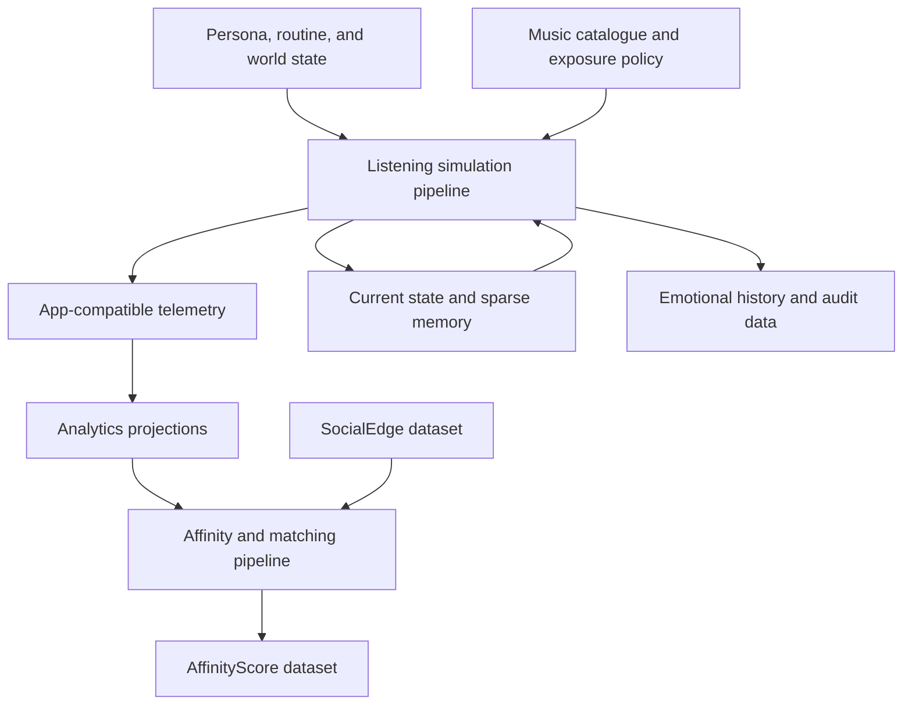

# Vibeout Personas Simulation

An auditable and reproducible system for running persistent synthetic music listeners and generating application-compatible behavioural telemetry.

**Status:** Architecture and contract design  
**Architecture version:** 1.0  
**Initial scale target:** 20,000 synthetic personas  
**Domain:** Everyday life, music discovery, listening behaviour, and emotional response

## Overview

Vibeout Personas Simulation models a long-lived population of synthetic users whose identities, circumstances, emotional states, music preferences, and listening histories evolve over simulated time.

The system periodically advances a persistent simulated world. Each execution determines which personas are due for processing, updates their state, evaluates whether they have an opportunity or motivation to listen, exposes them to plausible music candidates, simulates their application behaviour, and records the result as if it came from a real product telemetry system.

The objective is not to claim that human psychology is mathematically exact. The objective is to build a controlled environment in which behavioural hypotheses are explicit, versioned, reproducible, and independently analysable.

The project supports:

- Generating realistic listening histories before sufficient real-user data exists.
- Studying relationships between music, context, emotional state, and behaviour.
- Testing recommendation, discovery, retention, and analytics systems.
- Querying a persona's listening and emotional timeline as if they were a persistent user.
- Comparing observable behaviour with known synthetic ground truth.
- Running a separate affinity and matching pipeline over personas and their histories.

## Fundamental Boundaries

The simulator produces **plausible synthetic behaviour**, not predictions about a particular real person.

Four boundaries are mandatory:

1. Synthetic data and real-user data may share event contracts, but they must remain physically and logically distinguishable.
2. Observable application telemetry must remain separate from latent synthetic state.
3. The listening simulator must not depend on the affinity and matching pipeline.
4. JSON describes entity contracts; it does not imply one physical file per entity instance or persona.

## Core Model

At a given simulation time, listening behaviour emerges from four layers:

1. **Persistent identity** — stable personal background, psychology, musical identity, habits, and sensitivities.
2. **Dynamic state** — current emotion, energy, stress, attention, active needs, and incrementally maintained recent trends.
3. **Current context** — time, routine, activity, location, company, weather, device, application surface, and available time.
4. **Music environment** — catalogue, familiarity, memories, recommendation policy, trends, and candidate position.

```text
SimulationFrame(t) =
    PersonaProfile
  + PersonaStateCurrent(t - 1)
  + PersonaSchedule(t)
  + ActiveLifeEvents(t)
  + WorldState(location, t)
  + RelevantMusicMemory(t)
  + ApplicationContext(t)
```

Personas are stateful domain entities. They are not individual folders, independent processes, or autonomous LLM agents by default. Behavioural implementations may use rules, probability distributions, state machines, learned models, or optional AI components behind explicit versioned interfaces.

## System Architecture



The affinity pipeline is intentionally downstream and independent. It may read profiles, social edges, and derived behavioural summaries, but its output does not affect listening decisions in the current architecture.

## Main Entity Groups

All entities are typed logical contracts. Pydantic models will be the implementation source of truth and will export JSON Schema. The repository also contains representative JSON examples for architecture review.

| Group | Principal entities | Responsibility |
| --- | --- | --- |
| Simulation control | `SimulationConfig`, `SimulationInstance`, `ExecutionBatch` | Define and advance a continuous simulated world. |
| Persona | `PersonaProfile`, `PersonaStateCurrent`, `PersonaSchedule`, `LifeEvent` | Represent identity, current state, routines, and personal circumstances. |
| Music memory | `PersonTrackState`, `PersonArtistState` | Maintain sparse learned relationships with encountered music. |
| Shared environment | `WorldState`, `Artist`, `Track`, `ExposurePolicy` | Represent external conditions and music available to the platform. |
| Runtime | `ContextSnapshot`, `SimulationFrame`, `ListeningIntent`, `ExposureSet`, `CandidateEvaluation`, `PlaybackSessionState` | Carry temporary inputs and decisions through one evaluation. |
| App tracking | `ObservableEvent`, `ListeningSession` | Reproduce the telemetry contract of application usage. |
| State history | `StateTransition`, `EmotionalStateObservation` | Preserve state evolution and a queryable emotional timeline. |
| Audit | `OracleDecisionTrace`, `Checkpoint` | Explain, recover, and replay synthetic decisions. |
| Analytics | `DailyPersonaSummary`, `SimulationMetrics` | Provide derived query and experiment outputs. |
| Affinity | `SocialEdge`, `AffinityCalculation`, `AffinityScore` | Support a separate persona affinity and matching workflow. |

## Continuous Simulation Model

The population is not recreated every time the script executes.

- A `SimulationInstance` represents one long-lived synthetic world.
- An `ExecutionBatch` represents one scheduled invocation that advances that world from one logical time to another.
- `PersonaStateCurrent` survives between batches.
- All generated events retain both `simulation_id` and `execution_id` for lineage.
- A new experiment can fork from a checkpoint into a new `SimulationInstance` without mutating the original history.

This distinction prevents the overloaded concept of a "run" from meaning both an experiment and a cron invocation.

## Time Model

The engine combines a logical clock with an event queue:

- Ticks define the maximum state-evaluation interval.
- The scheduler processes only personas or playback sessions that are due.
- Inactive periods may advance without creating empty per-persona records.
- Per-persona state changes remain sequential.
- Different personas may be processed in parallel.
- Heartbeats can record compact emotional observations even when no listening event occurs.

The model supports stable, slow-changing, daily, session-level, and event-level timescales without copying the entire persona at every step.

## Listening Simulation Pipeline

### 1. Initialise or resume the simulation

Load the versioned scenario, population, catalogue, policies, random streams, latest checkpoint, and current persona states.

### 2. Start an execution batch

Create an immutable batch record, advance the logical clock, and select only due personas and active playback sessions.

### 3. Assemble current context

Join the persona profile and current state with routine, active life events, world state, recent music memory, and application context. `SocialEdge` is not read by this stage.

### 4. Evolve pre-listening state

Update current emotion, energy, stress, attention, motivation, and recent-state summaries according to elapsed time and active circumstances.

### 5. Evaluate opportunity and intent

Determine whether listening is possible and desirable. When it is, derive a listening function such as focus, activation, regulation, matching, exploration, comfort, or habit.

### 6. Generate exposure

Build the music the persona can realistically encounter through platform surfaces such as search, recommendations, playlists, autoplay, trends, or direct selection. Exposure remains separate from intrinsic preference.

### 7. Select and simulate playback

Sample a track or no-action outcome, then simulate product-visible behaviour such as play, pause, resume, seek, skip, complete, repeat, like, save, share, or session exit.

### 8. Apply response and learning

Update short-term emotional state and sparse long-term music memory. Familiarity, novelty, satisfaction, association, and satiation may influence future decisions.

### 9. Persist and reschedule

Commit app-compatible telemetry, meaningful state transitions, current state updates, emotional-history observations, session state, and the next scheduled event in one consistent unit of work.

### 10. Build analytical projections

Produce session, daily, emotional, musical, cohort, and simulation-level views without altering the canonical history.

## Realistic Application Tracking

Synthetic personas should produce the same event envelope and event semantics intended for Vibeout's real application. This allows the same analytics code to run against either source.

Every telemetry event includes:

- A globally unique event identifier.
- Event name and schema version.
- Actor and session identifiers.
- Occurrence and ingestion timestamps.
- Device, surface, and request context where relevant.
- `data_origin`, explicitly distinguishing `synthetic` from `real`.
- Synthetic lineage containing `simulation_id` and `execution_id` when applicable.
- A typed event payload.

Synthetic and real telemetry should use separate database schemas, databases, or datasets even when their contracts match. `data_origin` is an additional guard, not the only boundary.

## Emotional Tracking

The system maintains three complementary representations:

| Representation | Purpose | Persistence |
| --- | --- | --- |
| `PersonaStateCurrent` | Fast operational input for the next decision. | Updated in place with optimistic versioning. |
| `StateTransition` | Canonical append-only explanation of meaningful changes. | Retained for audit and replay. |
| `EmotionalStateObservation` | Compact time-series projection for querying an emotional journey. | Retained at configured observation points. |

An emotional observation is generated at relevant boundaries, including:

- Session start and end.
- Meaningful emotional changes.
- Life-event boundaries.
- Explicit mood check-ins, if the application exposes that feature.
- A configurable simulation-time heartbeat for inactive periods.

The listening pipeline does not scan the emotional-history table on every decision. Recent trajectory features—such as trend, volatility, and time in state—are updated incrementally inside `PersonaStateCurrent`.

Internal emotional state is synthetic ground truth. A mood declared through the application is observable telemetry and may differ because of reporting bias, uncertainty, or deliberate non-disclosure. The two must never be silently merged.

## Output Separation

### Observable application data

- Exposures and their position.
- Session lifecycle.
- Search and navigation actions.
- Playback actions and duration.
- Likes, saves, shares, and other feedback.
- Explicit mood check-ins when that product behaviour is enabled.

### Internal state data

- Latest persona state.
- Sparse persona-track and persona-artist memory.
- Active session state.
- State-transition deltas.
- Emotional-state observations.

### Oracle and audit data

- Latent emotional state.
- Listening motives.
- Candidate utilities and choice probabilities.
- Random draws and model decisions.
- Periodic checkpoints and integrity hashes.

Evaluation and recommendation systems must consume only the observable contract unless an experiment explicitly tests oracle-assisted behaviour.

## Persistence Strategy

PostgreSQL is the primary operational and historical source of truth for the initial architecture.

| Data class | Storage behaviour |
| --- | --- |
| Profiles and configuration | Versioned relational records, with JSONB only for bounded flexible sections. |
| Current state and active sessions | Mutable relational rows with version checks. |
| Telemetry, transitions, and emotional observations | Append-only, time-partitioned relational tables. |
| Persona-track and persona-artist memory | Sparse relational rows created only after meaningful contact. |
| Shared catalogue and world state | Stored once and referenced by identifier. |
| Checkpoints | Immutable snapshots with database metadata and external object references when large. |
| Analytical archive | Compressed Parquet partitions queried with DuckDB or another analytical engine. |

NoSQL is not required for the initial 20,000-persona target. PostgreSQL provides relationships, constraints, transactions, ordering, indexing, JSONB for controlled flexibility, and declarative partitioning for growing event tables.

JSON files in this repository are schema and example artifacts. They are not the runtime database layout and are not duplicated for each persona.

## Storage Growth Rules

Always retain:

- Versioned profiles and configuration.
- Latest current state.
- Application-compatible telemetry.
- Meaningful state transitions.
- Emotional observations required by the configured history policy.
- Completed session summaries.
- Execution lineage and periodic checkpoints.

Update instead of copying:

- Current persona state.
- Active playback session state.
- Rolling emotional features.
- Person-track and person-artist memory.

Sample or allowlist:

- Full simulation frames.
- Complete context snapshots.
- Candidate longlists and full utility vectors.
- Detailed oracle reasoning.

Aggregate or omit:

- Inactive ticks.
- Repeated no-op evaluations.
- High-frequency internal values that have not crossed a meaningful threshold.

## Audit and Replay

A selected decision can be reconstructed from:

- Simulation and execution identifiers.
- Frozen schema, scenario, catalogue, and model versions.
- Deterministic named random streams.
- The preceding checkpoint.
- Ordered state transitions and observable events.
- Input references or a sampled full runtime frame.

Retention modes control audit depth:

| Mode | Retention |
| --- | --- |
| Lean | Canonical telemetry, state transitions, compact emotional history, summaries, and checkpoints. |
| Standard | Lean data plus compact oracle traces and sampled full frames. |
| Forensic | Detailed inputs, candidates, probabilities, and random decisions for selected personas or windows. |

## Separate Affinity and Matching Pipeline

The repository also owns an independent affinity workflow:

```text
Persona profiles
    + SocialEdge records
    + derived listening and emotional summaries
    -> AffinityCalculation
    -> sparse AffinityScore records
```

`SocialEdge` represents an existing or simulated relationship and associated interaction evidence. `AffinityScore` represents a calculated, versioned result. They are not interchangeable.

The affinity pipeline:

- Is not invoked by the listening simulation pipeline.
- Does not mutate `PersonaStateCurrent` or music memory.
- Reads derived summaries instead of repeatedly scanning complete histories where possible.
- Calculates only requested or candidate pairs; it does not materialise all possible persona pairs.
- Records its own calculation and model version for reproducibility.

## Suggested Repository Structure

```text
vo-personas-simulation/
├── README.md
├── pyproject.toml
├── configs/
│   ├── scenarios/
│   ├── policies/
│   └── retention/
├── schemas/
│   ├── entity-contracts.schema.json
│   ├── persona-unified-schema.json
│   └── llm-models-schemas/
├── examples/
│   └── entity-examples.json
├── scripts/
│   └── generate_personas.py
├── docs/
│   ├── vibeout-synthetic-personas.md
│   ├── synthetic-listener-simulation-concept-map.md
│   └── synthetic-listener-simulation-architecture.md
├── src/vo_personas_simulation/
│   ├── domain/
│   ├── generation/
│   ├── simulation/
│   ├── telemetry/
│   ├── history/
│   ├── affinity/
│   ├── storage/
│   └── analytics/
├── tests/
│   ├── unit/
│   ├── integration/
│   ├── replay/
│   ├── contract/
│   └── statistical/
└── data/
    ├── fixtures/
    │   └── personas_fixture.jsonl
    └── generated/
```

Generated simulations and large analytical datasets should live outside version control.

## Generating Personas

`schemas/persona-unified-schema.json` is the field template for a synthetic persona: it merges the per-model schemas in `schemas/llm-models-schemas/` into one field per concept. The generator fills every field of it and writes one persona per line (JSONL):

```bash
python3 scripts/generate_personas.py --count 20000 --seed 42 --out data/generated/personas.jsonl
```

- Generation is deterministic: the same `--seed` and `--reference-date` produce a byte-identical file.
- Sections are built in causal order (country → age → education → work → household → personality → emotion → music → behaviour → devices → context → state → listening intent), so each field only depends on what came before.
- Every persona is checked against the schema's shape and a set of coherence rules in `src/vo_personas_simulation/generation/rules.py`. Examples: education is a trajectory, so nobody can be enrolled in a bachelor's degree after completing a master's; minors live with their parents and cannot drive; children are at least 16 years younger than their parent; the context device must be one the persona owns. Generation stops on the first incoherent persona.
- Personality and musical taste are deliberately varied. Each persona is a mixture of one or two archetypes rather than a clone of one.
- `data/fixtures/personas_fixture.jsonl` holds 100 personas (seed 42) for tests and review. Full populations go to `data/generated/`.

## Simulating Listening

Each run of the listening script is one moment in every persona's life: it recomputes their context, latent state and listening intent for that instant, chooses a real song from a local catalogue for the reasons that drive them, plays it (completed or skipped, liked or not) and remembers it for the next runs. Run it once, or several times a day.

**1. Spotify credentials.** Copy `.env.example` to `.env` and fill in `SPOTIFY_CLIENT_ID` and `SPOTIFY_CLIENT_SECRET` from your app at developer.spotify.com. `.env` is never committed.

**2. Check what your app can use** (3–4 requests):

```bash
python3 scripts/harvest_catalog.py --probe
```

**3. Simulate a moment.** Before simulating, the catalogue grows with a small request budget; every run continues where the previous one stopped, so the catalogue keeps getting bigger.

```bash
python3 scripts/simulate_listening.py                                     # now, one song per persona
python3 scripts/simulate_listening.py --at 2026-10-01T07:30:00Z --listens 3
python3 scripts/simulate_listening.py --offline --respect-listen-probability
```

| Option | Default | Meaning |
|---|---|---|
| `--personas` | `data/fixtures/personas_fixture.jsonl` | Personas to simulate. |
| `--at` | now | Simulated UTC instant; each persona lives it in their own time zone. |
| `--listens` | `1` | Songs in a row per persona in this run. |
| `--respect-listen-probability` | off | Let personas skip music when the moment does not suit it (asleep, no audio...). |
| `--harvest-requests` | `150` | Spotify request budget to grow the catalogue first. |
| `--offline` | off | Do not call Spotify. |
| `--seed` | `42` | With `--at`, the catalogue and the history, makes a run reproducible. |

Output: `data/generated/listens/<run>.jsonl`, one line per persona with the moment (context, state, intent), every song played and its `song_of_the_moment`:

```json
{"title": "...", "artists": ["..."], "year": 2009, "genres": ["opera"], "spotify_url": "https://open.spotify.com/track/...",
 "outcome": "completed", "liked": false, "features_source": "estimated",
 "reasons": [{"factor": "moment", "detail": "right for focus while working", "edge_over_others": 0.61}, ...]}
```

How a song is chosen (`src/vo_personas_simulation/listening/choice.py`): about 200 candidates are drawn from the persona's taste, nostalgia, what is popular, exploration and songs they already know; each is scored with named factors (taste, sound, mood, moment, nostalgia, popularity, novelty, familiarity, satiation, lyrics) weighted by the persona's traits; a softmax picks one, with more randomness for impulsive personas. The reasons are the factors where the chosen song beat the other candidates.

Local data, never committed: the catalogue in `data/catalog/music.sqlite` and the listening history (events, per-track and per-artist memory) in `data/simulation/listening.sqlite`.

Limits: new Spotify apps no longer receive audio features, so energy, valence, danceability, acousticness, instrumentalness and tempo are **estimated** from genre, era and popularity (`features_source: "estimated"`). Spotify content stays local and is only used to pick songs in the simulation; it is not used to train models.

Run the tests (no network needed; Spotify is replaced by a fake client):

```bash
python3 -m unittest tests/unit/test_rules.py tests/unit/test_catalog.py tests/unit/test_listening.py tests/statistical/test_population.py
```

## Implementation Principles

- Use Pydantic models as the code-level source of truth and generate JSON Schema from them.
- Keep domain contracts independent from PostgreSQL table definitions.
- Share telemetry contracts with Vibeout while physically isolating synthetic data.
- Preserve per-persona event order and make event ingestion idempotent.
- Make no-action a valid outcome at every behavioural decision.
- Record served exposures, not only successful listens.
- Keep exposure policy separate from intrinsic preference.
- Use sparse relationships rather than persona-by-track or persona-by-person Cartesian products.
- Make emotional history queryable without forcing the simulator to read it on every tick.
- Version behavioural assumptions as carefully as application code.
- Test deterministic replay, data contracts, invariants, and population-level statistical behaviour.

## Development Roadmap

1. Implement the typed domain models and generate the published JSON contracts.
2. Define the PostgreSQL operational and append-only table mappings.
3. Generate a small deterministic population fixture.
4. Implement continuous simulation instances, execution batches, the clock, and scheduler.
5. Implement state evolution and emotional-history recording.
6. Implement exposure, choice, playback, and application-compatible telemetry.
7. Add checkpoints, deterministic replay, and audit modes.
8. Build analytical projections and validation reports.
9. Scale-test 20,000 persistent personas.
10. Implement the independent affinity and matching pipeline.

## Documentation and Contracts

- [Conceptual map](./docs/synthetic-listener-simulation-concept-map.md)
- [Data architecture and execution pipeline](./docs/synthetic-listener-simulation-architecture.md)
- [Synthetic persona model](./docs/vibeout-synthetic-personas.md)
- [Entity JSON Schema catalog](./schemas/entity-contracts.schema.json)
- [Persona field template](./schemas/persona-unified-schema.json)
- [Persona generator](./scripts/generate_personas.py)
- [Representative entity examples](./examples/entity-examples.json)

## Project Principle

Preserve complexity where it affects behaviour and compress detail where it does not. The simulator's value comes from coherent identity over time, transparent assumptions, realistic observable events, queryable history, and reproducible decisions—not from pretending that a synthetic persona is an exact mathematical representation of a human being.
