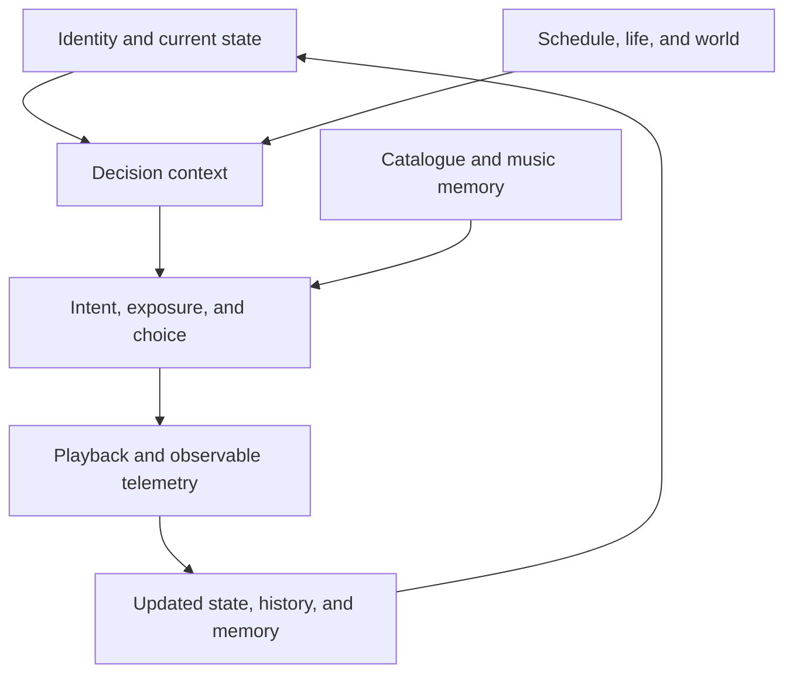

# VO Personas Simulation

## Entity Usage and End-to-End Listening Simulation Guide

**Document status:** Implementation guide  
**Architecture version:** 2.0  
**Contract source:** `entity-contracts.schema.json`  
**Purpose:** Explain when every entity is read, created, updated, retained, and joined during simulation.

---

## 1. Purpose

This document is the operational companion to the entity schema (/schemas/entity-contracts.schema.json). The JSON Schema defines the valid shape of each entity; this guide explains how those entities participate in the simulation and how implementation scripts should use them.

It answers four practical questions:

1. Which records must exist before a persona can be simulated?
2. Which entities are read, created, updated, or appended during one listening decision?
3. Which record tells us what a persona is listening to and which mood led to that choice?
4. Which entities are operational state, historical evidence, observable product telemetry, or optional audit data?

The JSON entities are logical contracts. They are not intended to become one JSON file per persona. Runtime instances should normally be stored as rows in shared PostgreSQL tables or emitted as records to an event store.

---

## 2. The Short Answer: Track, Mood, Motive, and Explanation

These concepts live in different entities because they answer different questions.

| Question | Authoritative entity | Relevant field or relationship |
| --- | --- | --- |
| What is the persona listening to right now? | `PlaybackSessionState` | `current_track_id` when `status = active` |
| What is the song? | `Track` and `Artist` | Join from `current_track_id` to `Track.track_id`, then `Track.artist_id` to `Artist.artist_id` |
| What did the application observe? | `ObservableEvent` | Events such as `track_started`, `track_progress`, `track_skipped`, and `track_completed` |
| What was the persona's internal mood immediately before choosing? | `EmotionalStateObservation` or the state version referenced by `SimulationFrame` | The predecision `emotion`, `stress`, `energy`, and `fatigue` values |
| Why did the persona decide to listen? | `ListeningIntent` | `motive`, `listen_probability`, `desired_emotion`, and `control_mode` |
| Why was this track selected? | `CandidateEvaluation` | Utility components such as affinity, mood fit, familiarity, satiation, and position effect |
| Which hidden decision and random draw produced the result? | `OracleDecisionTrace` | `frame_id`, `selected_outcome`, `latent_motive`, `random_stream`, and `random_draw` |
| How did listening affect the persona? | `StateTransition` and `EmotionalStateObservation` | Post-listening changes and the resulting emotional snapshot |
| What does the persona remember about the track? | `PersonTrackState` | Familiarity, learned affinity, satiation, associations, and play/skip counts |

Three distinctions are essential:

- `Track.emotion_profile` describes the emotional character of the song. It is not the listener's mood.
- `ListeningIntent.desired_emotion` describes the state the persona wants to reach. It is not necessarily the persona's current state.
- `EmotionalStateObservation.emotion` describes the simulator's latent internal mood. A mood explicitly declared in the app is instead an `ObservableEvent` and may differ from latent mood.

Therefore, a complete explanation should read approximately as follows:

> At 08:01, persona 42 was internally stressed and restless while commuting. The active work deadline increased stress. The persona formed an emotion-regulation intent and wanted to become more focused and hopeful. `City Lights` was exposed through home recommendations and selected because of high learned affinity, a positive match with the desired emotion, sufficient familiarity, low satiation, and its visible position. Playback then started in session 319.

---

## 3. Entity Layers

The entities form six different layers. They should not be treated as one undifferentiated collection.



| Layer | Responsibility | Principal entities |
| --- | --- | --- |
| Simulation control | Defines and advances a reproducible synthetic world | `SimulationConfig`, `SimulationInstance`, `ExecutionBatch`, `Checkpoint` |
| Persona and environment | Supplies identity, current state, routine, life circumstances, and world conditions | `PersonaProfile`, `PersonaStateCurrent`, `PersonaSchedule`, `ScheduleTemplate`, `LifeEvent`, `WorldState` |
| Music environment and memory | Supplies available music and the persona's learned relationship with it | `Artist`, `Track`, `PersonTrackState`, `PersonArtistState`, `ExposurePolicy` |
| Decision runtime | Carries the inputs and intermediate decisions for one evaluation | `ContextSnapshot`, `SimulationFrame`, `ListeningIntent`, `ExposureSet`, `CandidateEvaluation` |
| Playback, telemetry, and history | Represents active playback, observed actions, state changes, and emotional history | `PlaybackSessionState`, `ObservableEvent`, `ListeningSession`, `StateTransition`, `EmotionalStateObservation`, `OracleDecisionTrace` |
| Derived and independent processing | Produces summaries, metrics, and affinity results after canonical events exist | `DailyPersonaSummary`, `SimulationMetrics`, `SocialEdge`, `AffinityCalculation`, `AffinityScore` |

---

## 4. Persistence Vocabulary

This guide uses the following lifecycle terms.

| Term | Meaning |
| --- | --- |
| Immutable/versioned | Never overwrite a published version. Create a new version when behaviour or data changes. |
| Mutable/versioned | Keep one latest row and increment a version number on every committed update. |
| Append-only | Insert new historical records; never modify prior history except for explicitly supported corrections. |
| Lifecycle record | Created first and updated through states such as active, completed, or failed. |
| Transient | Exists only while calculating one decision unless audit policy requires retention. |
| Derived | Can be rebuilt from canonical records and therefore is not the source of truth. |
| Sparse | Create only after a meaningful relationship or interaction exists. Never prebuild the full Cartesian product. |

---

## 5. Supporting Value Objects

These definitions appear inside top-level entities and are not stored independently by default.

### `EmotionVector`

Represents emotion through valence, arousal, dominance, intensity, a primary label, and optional secondary labels.

It is reused for four different meanings:

- `PersonaProfile.emotional_profile.baseline`: long-term emotional baseline.
- `PersonaStateCurrent.emotion`: current latent emotional state.
- `Track.emotion_profile`: emotional character of a song.
- `ListeningIntent.desired_emotion`: target state sought through listening.
- `EmotionalStateObservation.emotion`: historical projection of latent state.

The caller must always preserve which of these meanings is being represented.

### `ApplicationContext`

Describes product-use conditions such as device, operating system, app version, surface, request, and network. It appears in `ContextSnapshot` and `ObservableEvent` so simulated telemetry can resemble real application telemetry.

### `SimulationLineage`

Connects a synthetic observable event to its simulation and execution. `decision_sequence` should identify the ordered persona decision that emitted the event.

### `StateChange`

One field-level delta inside a `StateTransition`. It records the path, operation, and before/after or delta values. A transition contains one or more changes.

### `ExposureItem`

One track position inside an `ExposureSet`. It distinguishes generated candidates from candidates actually served to the persona and stores source, rank position, ranking score, and reason code.

---

## 6. Simulation-Control Entities

### 6.1 `SimulationConfig`

**Models:** A versioned scenario definition: clock settings, behavioural model versions, policies, emotional observation rules, and retention mode.

**Used by:** The simulation bootstrapper, scheduler, state engine, listening engine, audit recorder, and checkpoint manager.

**Lifecycle:** Immutable per `config_version`. A material behavioural change creates a new version.

**Read frequency:** Once when a worker starts or once per execution batch; it should not be fetched separately for every persona.

**Important effect:** It determines whether session-boundary emotional observations, periodic heartbeats, full frames, or detailed oracle traces are retained.

### 6.2 `SimulationInstance`

**Models:** One continuous synthetic world with its own logical clock, seed, population, frozen model/catalogue versions, and optional parent checkpoint.

**Used by:** Every execution. All persona state and generated history are scoped by `simulation_id`.

**Lifecycle:** Created once, then moves through initialising, active, paused, completed, failed, or archived. Its logical time advances only to a fully committed boundary.

**Important distinction:** A simulation instance is not one cron execution. It persists across many executions.

### 6.3 `ExecutionBatch`

**Models:** One attempt by a script or worker group to advance a simulation between `logical_from` and `logical_to`.

**Used by:** The scheduler, workers, monitoring, retry logic, lineage, and batch-level metrics.

**Lifecycle:** Created at the start of a script invocation, marked running, and closed as completed, partially failed, or failed.

**Cardinality:** One per invocation, not one per persona.

**Important effect:** Every record emitted during the invocation should be traceable to its `execution_id` where the contract permits it.

### 6.4 `Checkpoint`

**Models:** A recoverable snapshot of current operational state, active playback, sparse music memory, scheduler state, logical time, and stream offsets.

**Used by:** Resume, recovery, replay, and experimental branching.

**Lifecycle:** Immutable and periodic. It is not created for every listen or every batch unless policy requires it.

**Not used for:** Normal emotional-history queries. Historical queries should use observations, transitions, and events.

---

## 7. Persona and Life-Context Entities

### 7.1 `PersonaProfile`

**Models:** Stable and slowly changing identity: demographics, personality, emotional tendencies, regulation preferences, musical identity, and life context.

**Used by:** State evolution, intent, exposure, choice, emotional response, cohort analytics, and affinity processing.

**Lifecycle:** Versioned. Never rewrite historical identity in place when the change should affect reproducibility.

**Simulation role:** Supplies coefficients and tendencies; it does not say what the persona feels at the present moment.

### 7.2 `PersonaStateCurrent`

**Models:** The latest operational state used by the next decision: emotion, stress, energy, fatigue, attention, satisfaction, activity, active events, recent trends, and next scheduled time.

**Used by:** Almost every behavioural stage.

**Lifecycle:** Exactly one mutable row per `(simulation_id, persona_id)`, updated with optimistic versioning.

**Read rule:** Read once at the start of a due-persona work item.

**Write rule:** Update atomically after all outputs for that work item have been calculated. Increment `state_version` only on a committed change.

**Not historical:** It cannot answer what the persona felt yesterday because it contains only the latest state.

### 7.3 `PersonaSchedule`

**Models:** Which shared routine template a persona follows, the persona's timezone, and personal overrides.

**Used by:** Context building and scheduling future evaluation times.

**Lifecycle:** Slowly changing and versioned.

**Simulation role:** Helps answer what the persona is plausibly doing at a given local time.

### 7.4 `ScheduleTemplate`

**Models:** Reusable probabilistic activity windows such as commuting, working, exercising, relaxing, or sleeping.

**Used by:** Many personas through reference from `PersonaSchedule`.

**Lifecycle:** Shared and immutable per version.

**Storage rule:** Store once. Never duplicate the full template for each persona.

### 7.5 `LifeEvent`

**Models:** A sparse time-bounded circumstance such as a deadline, breakup, holiday, illness, exam, family visit, or financial event.

**Used by:** Context and state evolution while active.

**Lifecycle:** Created as scheduled or active and updated through resolved or cancelled. Important lifecycle changes may also emit a `StateTransition` and an `EmotionalStateObservation`.

**Simulation role:** Adds situation-specific pressure or support beyond the persona's baseline.

---

## 8. Shared World, Catalogue, and Music-Memory Entities

### 8.1 `WorldState`

**Models:** Shared external conditions for one location and time bucket: weather, daylight, season, holiday, and trend context.

**Used by:** Context building and state evolution.

**Lifecycle:** Appended or upserted by location/time bucket.

**Storage rule:** Store once per location and time bucket and reference it from all relevant personas.

### 8.2 `Artist`

**Models:** Shared artist identity and catalogue-level attributes.

**Used by:** Candidate generation, artist-level preference, analytics, and display joins.

**Lifecycle:** Rarely changing and versioned.

### 8.3 `Track`

**Models:** Shared song metadata, audio features, genres, language, lyrical themes, emotional profile, duration, and market availability.

**Used by:** Exposure filtering, ranking, candidate evaluation, playback simulation, emotional response, and analytics.

**Lifecycle:** Rarely changing and versioned.

**Important distinction:** `Track.emotion_profile` is a property of the music. Compare it with current and desired listener emotions; do not treat it as the listener's mood.

### 8.4 `PersonTrackState`

**Models:** The learned relationship between one persona and one encountered track: familiarity, learned affinity, satiation, emotional associations, exposures, plays, and skips.

**Used by:** Candidate ranking, choice, repetition, novelty/familiarity behaviour, and future emotional associations.

**Lifecycle:** Sparse and mutable/versioned. Create it only after qualifying exposure or interaction.

**Write timing:** Update after exposure and playback outcomes are known.

### 8.5 `PersonArtistState`

**Models:** Optional artist-level memory: familiarity, affinity, loyalty, satiation, and play count.

**Used by:** Artist-level ranking, discovery, loyalty, and fatigue effects.

**Lifecycle:** Optional, sparse, and mutable/versioned.

**Implementation note:** It can initially be omitted if track-level memory and derived artist aggregates are sufficient.

### 8.6 `ExposurePolicy`

**Models:** What the product is capable of showing: candidate sources, eligibility rules, ranking model, position effects, item limits, and autoplay policy.

**Used by:** Exposure generation before track choice.

**Lifecycle:** Immutable per policy version.

**Important distinction:** Exposure policy represents product availability and visibility. It must remain separate from intrinsic persona preference.

---

## 9. Runtime Decision Entities

### 9.1 `ContextSnapshot`

**Models:** The resolved situation at one logical moment: activity, location, company, privacy, available time, app context, and references to source records.

**Created by:** Context builder.

**Consumed by:** State evolution, intent, playback, and audit.

**Default persistence:** Keep the hash and source references. Store the full object only for sampled or allowlisted decisions, depending on audit mode.

### 9.2 `SimulationFrame`

**Models:** The complete versioned input boundary for one behavioural decision. It binds profile version, state version, context, active life events, and relevant music memory.

**Created by:** Frame assembler.

**Consumed by:** Intent, exposure, choice, playback, and oracle tracing.

**Default persistence:** Transient; sample or retain for selected personas/windows.

**Critical rule:** The frame referenced by track choice must point to the state version after pre-listening evolution. If state version 193 evolves to 194 before intent and choice, the decision frame must reference 194.

### 9.3 `ListeningIntent`

**Models:** Whether listening is possible and desired, the probability of listening, the chosen listen/no-listen outcome, the motive, desired emotion, time budget, and control mode.

**Created by:** Intent engine after current context and pre-listening state have been resolved.

**Consumed by:** Exposure generation, candidate evaluation, playback, and post-listening response.

**Persistence:** Retain a compact record for actual opportunities when explanation is required. In lean mode it may be represented through a compact oracle trace and canonical outputs.

**Important distinction:** `motive = emotion_regulation` explains why music is sought; `desired_emotion` describes the target state.

### 9.4 `ExposureSet`

**Models:** Which tracks were generated, ranked, and actually served through a specific surface and policy.

**Created by:** Exposure engine.

**Consumed by:** Candidate evaluator and choice sampler.

**Persistence:** Served items must survive as observable exposure telemetry. Unserved longlists are transient unless sampled for audit.

### 9.5 `CandidateEvaluation`

**Models:** The calculated utility and choice probability for one exposed track, including interpretable utility components.

**Created by:** Choice engine, one per candidate plus an internal no-action alternative.

**Consumed by:** Deterministic random choice sampler and audit tooling.

**Persistence:** Transient by default; store compact or full evaluations only according to audit policy.

**Simulation role:** This is the clearest record for explaining why one candidate was preferred over another.

---

## 10. Playback, Telemetry, State History, and Audit Entities

### 10.1 `PlaybackSessionState`

**Models:** Mutable operational playback: active/paused/ended status, current track, playback position, queue, and next decision time.

**Created by:** Playback engine when a listening session begins.

**Consumed by:** Subsequent scheduled playback decisions.

**Lifecycle:** Mutable while active. When the session ends, retain the `ListeningSession` summary and observable events; the active row can be removed, archived, or marked ended according to implementation policy.

**Authoritative use:** This is the fastest source for answering what is playing now.

### 10.2 `ObservableEvent`

**Models:** Something a real application could observe: session, discovery, exposure, playback, feedback, navigation, or explicit mood-check-in behaviour.

**Created by:** Telemetry emitter during exposure and playback.

**Consumed by:** Product analytics, recommendations, session reconstruction, and real-versus-synthetic comparisons.

**Lifecycle:** Append-only, time-partitioned, and idempotent.

**Boundary:** It must not expose latent mood, hidden motive, unserved candidates, utility vectors, or random draws.

### 10.3 `ListeningSession`

**Models:** Queryable session lifecycle and final aggregate: start/end, source surface, primary intent, event count, track count, listened time, and completion reason.

**Created by:** Playback/session manager.

**Lifecycle:** Mutable while active, then retained as a completed, abandoned, or failed summary.

**Not sufficient for:** Listing the exact tracks heard. Use `ObservableEvent` records linked by `session_id` for the detailed sequence.

### 10.4 `StateTransition`

**Models:** A meaningful change between two persona state versions, including its cause, source references, and field-level changes.

**Created by:** Pre-listening evolution, life-event handling, playback response, and other state-changing processes.

**Consumed by:** Replay, debugging, causal inspection, and state reconstruction.

**Lifecycle:** Append-only.

**Authoritative use:** Explains how and why state changed. It is not optimised as the primary emotional time-series query table.

### 10.5 `EmotionalStateObservation`

**Models:** A compact historical projection of latent emotion and related variables at selected moments.

**Created by:** Observation projector on heartbeats, thresholds, session boundaries, life-event boundaries, mood check-ins, or forensic capture.

**Consumed by:** Emotional timeline queries, regulation analysis, cohort analysis, and mood-inference evaluation.

**Lifecycle:** Append-only and time-partitioned.

**Authoritative use:** Use the predecision or `session_start` observation to answer which latent mood preceded a listen. Use a post-listening or `session_end` observation to evaluate emotional effect.

### 10.6 `OracleDecisionTrace`

**Models:** Hidden synthetic ground truth for one decision: decision type, frame, model version, random stream/draw, selected outcome, latent motive, and utility summary.

**Created by:** Behavioural decision engines.

**Consumed by:** Reproducibility checks, debugging, explanation, and evaluation of inference systems.

**Persistence:** Minimal in lean mode, compact for all decisions in standard mode, and detailed for selected forensic windows.

**Boundary:** Store separately from observable telemetry. A real application would not know this information.

---

## 11. Derived Analytics Entities

### 11.1 `DailyPersonaSummary`

**Models:** One day's derived listening and emotional aggregates for one persona.

**Created by:** A projection job after canonical events and observations exist.

**Consumed by:** Dashboards, cohort analysis, affinity feature generation, and faster longitudinal queries.

**Lifecycle:** Derived/upserted by `(simulation_id, persona_id, local_date, summary_version)`.

**Boundary:** It never drives canonical simulation state unless a future explicitly versioned feature pipeline chooses to consume it.

### 11.2 `SimulationMetrics`

**Models:** Versioned metrics over a persona, cohort, execution, or full simulation and a defined time window.

**Created by:** Analytics jobs.

**Consumed by:** Experiment comparison, quality validation, scale monitoring, and statistical tests.

**Lifecycle:** Derived and versioned. Always record metric-definition version and data origin.

---

## 12. Independent Affinity Entities

These entities belong to the same repository but are not used by the listening simulation pipeline.

### 12.1 `SocialEdge`

**Models:** Existing or simulated relationship evidence between two personas: relationship type, direction, strength, trust, and interactions.

**Used by:** Only the separate affinity/matching context and possible social-analysis tools.

**Not read by:** Context, intent, exposure, choice, playback, or emotional-response code in architecture version 2.0.

### 12.2 `AffinityCalculation`

**Models:** One versioned affinity-processing execution, including input window, candidate-pair policy, feature version, model version, and input fingerprint.

**Used by:** The affinity batch coordinator.

**Lifecycle:** Lifecycle updates while running, immutable after completion.

### 12.3 `AffinityScore`

**Models:** A sparse calculated compatibility result for one candidate pair, including musical, emotional-pattern, behavioural-rhythm, and optional social-context dimensions.

**Used by:** Match lookup, ranking, and evaluation outside the listening simulation.

**Lifecycle:** Append/versioned by affinity calculation.

**Boundary:** It must not influence listening choices unless a future architecture version introduces that dependency explicitly.

---

## 13. Minimum Data Required Before Simulating a Persona

The following records must be available before processing a due persona.

### Process-level inputs

- `SimulationConfig`
- `SimulationInstance`
- An open `ExecutionBatch`
- Catalogue versions and `ExposurePolicy`

These should be cached or loaded once per batch where safe.

### Persona-level inputs

- `PersonaProfile`
- `PersonaStateCurrent`
- `PersonaSchedule`
- Referenced `ScheduleTemplate`
- Any active `LifeEvent` records
- Relevant `WorldState`

### Music inputs

- Eligible `Track` and `Artist` records
- Existing sparse `PersonTrackState` records for relevant candidates
- Optional `PersonArtistState` records

### Inputs that are not required

- Previous `DailyPersonaSummary` records
- Previous `SimulationMetrics`
- `SocialEdge`
- `AffinityCalculation`
- `AffinityScore`
- The persona's entire emotional history

Recent history needed for decisions must be carried as bounded incremental features inside `PersonaStateCurrent`, not recomputed by scanning all historical observations on every tick.

---

## 14. One Complete Listening-Decision Pipeline

This section describes exactly which entities a script touches when one due persona starts listening.

| Stage | Reads | Produces or updates | Persistence behaviour |
| --- | --- | --- | --- |
| 0. Resume world | `SimulationConfig`, `SimulationInstance`, optional `Checkpoint` | Restored workers, versions, clock, random streams | Process-level operation |
| 1. Open batch | `SimulationInstance` | `ExecutionBatch` | One lifecycle record per invocation |
| 2. Select work | `PersonaStateCurrent.next_scheduled_event_at`, active `PlaybackSessionState` | Due-persona work list | Scheduler state only |
| 3. Build context | `PersonaProfile`, current state, schedule/template, active life events, `WorldState` | `ContextSnapshot` | Hash/refs retained; full snapshot sampled |
| 4. Evolve state | Current state, context, elapsed time, life events | In-memory new state; optional `StateTransition`; optional observation | Transition/observation appended if policy requires |
| 5. Freeze decision input | Updated state plus context and relevant memory refs | `SimulationFrame` | Transient or sampled |
| 6. Evaluate intent | Decision frame | `ListeningIntent` | Compact record for evaluated opportunity according to retention policy |
| 7. Generate exposure | Intent, policy, catalogue, memory | `ExposureSet`; exposure `ObservableEvent` records | Served items retained; unserved longlist sampled/omitted |
| 8. Choose track | Exposure, intent, state, memory | `CandidateEvaluation`; `OracleDecisionTrace`; selected track/no-action | Evaluations transient/sampled; trace policy-controlled |
| 9. Start playback | Selected track and app context | `PlaybackSessionState`, `ListeningSession`, `track_started` event | Active rows updated; event appended |
| 10. Continue playback | Active playback state, attention, time budget | Progress/pause/skip/complete events and updated playback state | Events appended; current playback row updated |
| 11. Apply response | Outcome, track, pre-listening state, profile sensitivity | Post-listening `StateTransition`, optional observation, new current state | Transition/observation appended |
| 12. Learn memory | Exposures and actions | Upsert `PersonTrackState`; optional `PersonArtistState` | Sparse mutable rows |
| 13. Commit persona | All calculated results | Updated `PersonaStateCurrent`, next scheduled event | One atomic persona consistency boundary |
| 14. Close batch | Work-item results | Final `ExecutionBatch`; updated simulation logical time; optional `Checkpoint` | Batch lifecycle and periodic checkpoint |
| 15. Project analytics | Events, sessions, transitions, observations | `DailyPersonaSummary`, `SimulationMetrics` | Asynchronous derived data |

### No-listen path

`selected_outcome = no_listen` is valid and expected. In that path:

- Persist or sample the `ListeningIntent` according to policy.
- Optionally record a compact `OracleDecisionTrace`.
- Persist any pre-listening state transition or due emotional observation.
- Do not create a listening session, playback state, exposure set, or playback event unless the product actually displayed content before the no-action outcome.
- Update `PersonaStateCurrent.next_scheduled_event_at` and commit.

---

## 15. Worked Example: From Stress to `City Lights`

### 15.1 Situation

At 08:00 simulated time:

- Persona `persona_000042` is commuting alone in Barcelona.
- An active work deadline is increasing stress.
- Weather is cloudy.
- The persona has moderate energy, high stress, and a stressed/restless emotional state.
- Music is important to this persona, and emotion regulation is a preferred listening function.
- The persona already knows `track_city_lights`, likes it, and is not currently saturated by it.

### 15.2 Input records read

The script reads these logical records:

```text
SimulationConfig scenario_everyday_listening_v1@2.0.0
SimulationInstance sim_2026_09_main
ExecutionBatch exec_2026_09_03_0800
PersonaProfile persona_000042@1
PersonaStateCurrent sim_2026_09_main/persona_000042@193
PersonaSchedule persona_000042@1
ScheduleTemplate schedule_office_weekday_v1@1
LifeEvent life_event_deadline_42
WorldState location_barcelona@2026-09-03T08:00:00Z
ExposurePolicy policy_default_v1
Track track_city_lights@1
Artist artist_aurora_lines@1
PersonTrackState persona_000042/track_city_lights@8
PersonArtistState persona_000042/artist_aurora_lines@12
```

### 15.3 Pre-listening state evolution

The state engine combines elapsed time, commuting context, baseline reversion, and the active deadline. It commits a meaningful transition from version 193 to 194.

```json
{
  "entity_type": "StateTransition",
  "transition_id": "transition_42_193_194",
  "simulation_id": "sim_2026_09_main",
  "execution_id": "exec_2026_09_03_0800",
  "persona_id": "persona_000042",
  "occurred_at": "2026-09-03T08:00:00Z",
  "previous_state_version": 193,
  "resulting_state_version": 194,
  "cause": "pre_listening_time_evolution",
  "source_refs": {
    "context_id": "context_42_20260903_0800",
    "life_event_id": "life_event_deadline_42"
  },
  "changes": [
    {
      "path": "emotion.valence",
      "operation": "increment",
      "before": -0.12,
      "after": -0.09,
      "delta": 0.03
    },
    {
      "path": "stress",
      "operation": "increment",
      "before": 0.72,
      "after": 0.75,
      "delta": 0.03
    }
  ],
  "model_version": "state_transition_1.0.0",
  "idempotency_key": "sim_2026_09_main:42:193:194"
}
```

### 15.4 Decision frame

The choice must use state version 194 because that is the state after pre-listening evolution.

```json
{
  "entity_type": "SimulationFrame",
  "frame_id": "frame_42_194_decision_319",
  "simulation_id": "sim_2026_09_main",
  "execution_id": "exec_2026_09_03_0800",
  "persona_id": "persona_000042",
  "logical_time": "2026-09-03T08:01:00Z",
  "profile_ref": "persona_000042@1",
  "state_version": 194,
  "context_id": "context_42_20260903_0800",
  "active_life_event_ids": ["life_event_deadline_42"],
  "relevant_track_state_ids": ["persona_000042:track_city_lights"],
  "input_hash": "sha256:frame-42-194-decision-319"
}
```

### 15.5 Mood immediately before selection

Because session-boundary observations are enabled, the simulator records the latent state at session start. This is the historical mood record to use for this decision.

```json
{
  "entity_type": "EmotionalStateObservation",
  "observation_id": "emotion_obs_42_session_319_start",
  "simulation_id": "sim_2026_09_main",
  "execution_id": "exec_2026_09_03_0800",
  "persona_id": "persona_000042",
  "observed_at": "2026-09-03T08:01:05Z",
  "observation_reason": "session_start",
  "emotion": {
    "valence": -0.09,
    "arousal": 0.68,
    "dominance": 0.42,
    "intensity": 0.59,
    "primary_label": "stressed",
    "secondary_labels": ["restless"]
  },
  "energy": 0.61,
  "stress": 0.75,
  "fatigue": 0.39,
  "activity": "commuting",
  "location_id": "location_barcelona",
  "state_version": 194,
  "source_transition_id": "transition_42_193_194",
  "source_event_id": "event_42_319_session_started",
  "projection_version": "emotion_projection_1.0.0",
  "idempotency_key": "sim_2026_09_main:42:319:session_start"
}
```

This says what the persona felt before playback. It does not yet explain why music was selected or why this particular track won.

### 15.6 Listening intent

```json
{
  "entity_type": "ListeningIntent",
  "intent_id": "intent_42_319",
  "simulation_id": "sim_2026_09_main",
  "execution_id": "exec_2026_09_03_0800",
  "persona_id": "persona_000042",
  "logical_time": "2026-09-03T08:01:00Z",
  "opportunity_available": true,
  "listen_probability": 0.82,
  "selected_outcome": "listen",
  "motive": "emotion_regulation",
  "desired_emotion": {
    "valence": 0.35,
    "arousal": 0.58,
    "dominance": 0.62,
    "intensity": 0.46,
    "primary_label": "focused",
    "secondary_labels": ["hopeful"]
  },
  "time_budget_minutes": 30,
  "control_mode": "active_selection"
}
```

Interpretation:

- Current mood: stressed/restless.
- Motive: regulate emotion.
- Desired mood: focused/hopeful.
- Listening is probable but not guaranteed.

### 15.7 Exposure and track choice

The product exposes `track_city_lights` through home recommendations.

```json
{
  "entity_type": "ExposureSet",
  "exposure_set_id": "exposure_set_42_319",
  "simulation_id": "sim_2026_09_main",
  "execution_id": "exec_2026_09_03_0800",
  "persona_id": "persona_000042",
  "session_id": "session_0042_319",
  "policy_id": "policy_default_v1",
  "created_at": "2026-09-03T08:01:02Z",
  "surface": "home_recommendations",
  "items": [
    {
      "track_id": "track_city_lights",
      "position": 0,
      "source": "personalised_recommendation",
      "served": true,
      "ranking_score": 0.88,
      "reason_code": "mood_and_history"
    }
  ]
}
```

The choice engine evaluates the exposed track.

```json
{
  "entity_type": "CandidateEvaluation",
  "evaluation_id": "candidate_eval_42_319_0",
  "simulation_id": "sim_2026_09_main",
  "execution_id": "exec_2026_09_03_0800",
  "persona_id": "persona_000042",
  "exposure_set_id": "exposure_set_42_319",
  "track_id": "track_city_lights",
  "utility": 1.74,
  "choice_probability": 0.61,
  "components": {
    "intrinsic_affinity": 0.81,
    "desired_emotion_match": 0.66,
    "familiarity": 0.42,
    "satiation_penalty": -0.19,
    "position_effect": 0.04
  },
  "selected": true
}
```

The selected track is not explained by mood alone. It results from the combination of:

- Current and desired emotional state.
- Stable genre and artist preferences.
- Learned track affinity.
- Familiarity and novelty preference.
- Satiation.
- Product exposure and position.
- A deterministic random draw.

The hidden decision trace records the final choice.

```json
{
  "entity_type": "OracleDecisionTrace",
  "trace_id": "oracle_choice_42_319",
  "simulation_id": "sim_2026_09_main",
  "execution_id": "exec_2026_09_03_0800",
  "persona_id": "persona_000042",
  "decision_type": "track_choice",
  "decided_at": "2026-09-03T08:01:09Z",
  "frame_id": "frame_42_194_decision_319",
  "model_version": "track_choice_1.0.0",
  "random_stream": "track_choice",
  "random_draw": 0.4172,
  "selected_outcome": "track_city_lights",
  "latent_motive": "emotion_regulation",
  "utility_summary": {
    "selected_utility": 1.74,
    "no_action_utility": 0.21
  },
  "audit_level": "compact"
}
```

### 15.8 Playback starts

The current operational playback row now answers exactly what is playing.

```json
{
  "entity_type": "PlaybackSessionState",
  "simulation_id": "sim_2026_09_main",
  "persona_id": "persona_000042",
  "session_id": "session_0042_319",
  "state_version": 2,
  "status": "active",
  "current_track_id": "track_city_lights",
  "started_at": "2026-09-03T08:01:10Z",
  "last_event_at": "2026-09-03T08:01:10Z",
  "position_ms": 0,
  "queue_track_ids": ["track_city_lights", "track_open_water"],
  "next_decision_at": "2026-09-03T08:01:40Z"
}
```

The application-compatible event records what an app could observe.

```json
{
  "entity_type": "ObservableEvent",
  "event_id": "event_42_319_track_started",
  "event_name": "track_started",
  "event_version": 1,
  "occurred_at": "2026-09-03T08:01:10Z",
  "ingested_at": "2026-09-03T08:01:10Z",
  "actor_id": "persona_000042",
  "session_id": "session_0042_319",
  "track_id": "track_city_lights",
  "data_origin": "synthetic",
  "idempotency_key": "sim_2026_09_main:42:319:track_started:1",
  "simulation_lineage": {
    "simulation_id": "sim_2026_09_main",
    "execution_id": "exec_2026_09_03_0800",
    "decision_sequence": 319
  },
  "application_context": {
    "device_type": "mobile",
    "operating_system": "ios",
    "app_version": "0.8.0",
    "surface": "home_recommendations",
    "request_id": "req_8f42",
    "network_type": "5g"
  },
  "payload": {
    "source": "personalised_recommendation",
    "position": 0,
    "autoplay": false,
    "initial_position_ms": 0
  }
}
```

### 15.9 Post-listening response

Suppose the persona listens to most of the track and the simulation calculates a moderate successful regulation effect. The state engine may produce a transition such as:

```json
{
  "entity_type": "StateTransition",
  "transition_id": "transition_42_194_195",
  "simulation_id": "sim_2026_09_main",
  "execution_id": "exec_2026_09_03_0800",
  "persona_id": "persona_000042",
  "occurred_at": "2026-09-03T08:04:48Z",
  "previous_state_version": 194,
  "resulting_state_version": 195,
  "cause": "post_listening_response",
  "source_refs": {
    "session_id": "session_0042_319",
    "track_id": "track_city_lights",
    "event_id": "event_42_319_track_completed"
  },
  "changes": [
    {
      "path": "emotion.valence",
      "operation": "increment",
      "before": -0.09,
      "after": 0.18,
      "delta": 0.27
    },
    {
      "path": "stress",
      "operation": "decrement",
      "before": 0.75,
      "after": 0.56,
      "delta": -0.19
    },
    {
      "path": "satisfaction",
      "operation": "increment",
      "before": 0.47,
      "after": 0.68,
      "delta": 0.21
    }
  ],
  "model_version": "music_response_1.0.0",
  "idempotency_key": "sim_2026_09_main:42:194:195"
}
```

This resulting state is written to `PersonaStateCurrent`, projected to `EmotionalStateObservation` if a threshold or boundary trigger fires, and used by the persona's next decision.

### 15.10 Music-memory update

The existing `PersonTrackState` is updated rather than copied into a new history document. Its `state_version`, familiarity, affinity, satiation, play count, emotional associations, and timestamps may change. The immutable playback event remains the historical evidence from which the update was derived.

### 15.11 Records not involved

The following entities are not read or written by this listening decision:

- `SocialEdge`
- `AffinityCalculation`
- `AffinityScore`

`DailyPersonaSummary` and `SimulationMetrics` are produced later by analytical projection jobs, not inside the persona transaction.

`Checkpoint` is produced only if the batch crosses a configured checkpoint boundary.

---

## 16. How to Retrieve the Current Track and Its Causal Mood

### 16.1 Fast operational query

To answer **what is playing now**:

1. Load `PlaybackSessionState` for `(simulation_id, persona_id)` where `status = active`.
2. Read `current_track_id`.
3. Join `Track` and `Artist` for metadata.

Conceptual SQL:

```sql
SELECT
    pss.persona_id,
    pss.session_id,
    pss.current_track_id,
    track.title,
    artist.name AS artist_name,
    pss.position_ms,
    pss.last_event_at
FROM playback_session_state AS pss
JOIN track
  ON track.track_id = pss.current_track_id
JOIN artist
  ON artist.artist_id = track.artist_id
WHERE pss.simulation_id = :simulation_id
  AND pss.persona_id = :persona_id
  AND pss.status = 'active';
```

### 16.2 Historical playback query

To answer **what did this persona listen to**:

1. Query `ObservableEvent` by `simulation_id`, `actor_id`, and time range.
2. Filter playback events.
3. Group by `session_id` and order by `occurred_at`.
4. Join `Track` and `Artist`.

Use start, progress, completion, and skip events to derive duration-weighted listening instead of counting only track starts.

### 16.3 Latent mood that led to a choice

The preferred causal chain is:

```text
PlaybackSessionState.current_track_id
    -> ObservableEvent(session_id, track_id, decision_sequence)
    -> OracleDecisionTrace(selected_outcome, frame_id)
    -> SimulationFrame(state_version, context_id)
    -> EmotionalStateObservation(state_version, session_start)
    -> StateTransition(source_refs and changes)
    -> ListeningIntent(motive and desired_emotion)
    -> CandidateEvaluation(why this track won)
```

This answers different parts of the explanation:

- Observation: what the persona felt.
- Transition: what caused that state.
- Intent: why the persona wanted music and what state was desired.
- Candidate evaluation: why the track fit.
- Oracle trace: how the stochastic choice was resolved.
- Observable event: what the application saw.

### 16.4 Declared mood instead of latent mood

If the product asks the user how they feel, query an `ObservableEvent` such as `mood_check_in_submitted`. Do not replace the internal observation with the declared value.

For evaluation, compare:

```text
declared mood from ObservableEvent
versus
latent mood from EmotionalStateObservation
```

The difference is useful synthetic ground truth for testing mood inference and reporting bias.

---

## 17. Required Lineage Convention Before Script Implementation

The current schema contains enough information to correlate the example through persona, execution, time, session, selected track, frame, and `decision_sequence`. However, some of these joins are temporal or implicit rather than explicit foreign-key relationships.

That is acceptable for architecture exploration but too fragile for production-grade causal queries. Two track choices could occur in the same execution, and identifiers such as `intent_42_319` must not be parsed to discover relationships.

Before implementing the scripts, adopt one explicit `decision_id` convention.

### Recommended internal lineage

Generate one deterministic `decision_id` for every behavioural decision:

```text
decision_id = hash(
    simulation_id
    + persona_id
    + decision_sequence
    + decision_kind
)
```

Carry it through internal records:

- `SimulationFrame`
- `ListeningIntent`
- `ExposureSet`
- `CandidateEvaluation`
- `OracleDecisionTrace`
- `PlaybackSessionState`
- `ListeningSession`
- `StateTransition.source_refs`
- `EmotionalStateObservation` through an explicit field or source event

For observable telemetry, keep the public event contract clean. The existing `simulation_lineage.decision_sequence` can correlate synthetic events internally without exposing latent mood or oracle details as product payload.

### Minimal explicit-reference additions

If the next schema revision does not introduce a universal `decision_id`, add at least:

| Entity | Recommended reference |
| --- | --- |
| `ListeningIntent` | `frame_id` |
| `ExposureSet` | `intent_id` |
| `CandidateEvaluation` | `intent_id` or retain the path through `exposure_set_id` |
| `OracleDecisionTrace` | `intent_id`, optional `session_id`, and selected `evaluation_id` |
| `PlaybackSessionState` | `intent_id` or internal `decision_id` |
| `ListeningSession` | `intent_id` or internal `decision_id` |
| `EmotionalStateObservation` | Optional `session_id`/`decision_id`; keep `source_event_id` as well |

No new business entity is strictly necessary. The requirement is an explicit causal identifier shared by the existing entities.

### Example alignment rule

The representative examples currently show an initial frame based on state version 193 and a pre-listening transition to version 194. The implementation must ensure that the frame referenced by the actual track-choice trace points to version 194, because the choice is made after pre-listening evolution.

---

## 18. Transaction Boundary for One Persona

The due-persona work item is the atomic consistency boundary.

Within one transaction or transactional-outbox operation:

1. Read `PersonaStateCurrent` and retain `previous_state_version`.
2. Resolve context and calculate deterministic outputs.
3. Append new `ObservableEvent`, `StateTransition`, and `EmotionalStateObservation` records.
4. Upsert `PersonTrackState`, optional `PersonArtistState`, active `PlaybackSessionState`, and `ListeningSession`.
5. Update `PersonaStateCurrent` only where its version still equals `previous_state_version`.
6. Increment the state version and schedule the next due time.
7. Commit all records together.

If the optimistic version check fails, discard calculated outputs and retry from the newly committed current state.

Every append-only record requires a deterministic unique idempotency key. A retry must reproduce the same identifiers and must not duplicate telemetry or state history.

---

## 19. Suggested Script Decomposition

The entities suggest the following implementation modules.

```python
def process_due_persona(simulation_id, execution_id, persona_id, logical_time):
    current = state_repository.get_for_update(simulation_id, persona_id)
    profile = profile_repository.get_version(persona_id, current.profile_version)

    context = context_builder.build(
        profile=profile,
        current_state=current,
        schedule=schedule_repository.resolve(persona_id, logical_time),
        life_events=life_event_repository.active(persona_id, logical_time),
        world_state=world_repository.resolve(profile, logical_time),
    )

    pre_state_result = state_engine.evolve_before_decision(
        profile=profile,
        previous_state=current,
        context=context,
        logical_time=logical_time,
    )

    decision_frame = frame_builder.build(
        profile=profile,
        state=pre_state_result.resulting_state,
        context=context,
    )

    intent = intent_engine.evaluate(decision_frame)

    if intent.selected_outcome == "no_listen":
        return commit_no_listen_result(
            current=current,
            pre_state_result=pre_state_result,
            intent=intent,
        )

    exposure = exposure_engine.generate(
        frame=decision_frame,
        intent=intent,
        policy=exposure_policy,
        catalogue=catalogue,
        music_memory=music_memory_repository.relevant(persona_id),
    )

    evaluations = choice_engine.evaluate_candidates(
        frame=decision_frame,
        intent=intent,
        exposure=exposure,
    )
    selected = choice_engine.sample(evaluations)

    playback_result = playback_engine.start_or_continue(
        selected=selected,
        frame=decision_frame,
        intent=intent,
    )

    post_state_result = state_engine.apply_music_response(
        profile=profile,
        pre_listening_state=pre_state_result.resulting_state,
        track=selected.track,
        playback_outcome=playback_result,
        intent=intent,
    )

    memory_updates = music_memory_engine.apply(
        exposure=exposure,
        playback_result=playback_result,
        emotional_response=post_state_result,
    )

    return unit_of_work.commit_persona_result(
        expected_state_version=current.state_version,
        context=context,
        frame=decision_frame,
        intent=intent,
        exposure=exposure,
        evaluations=evaluations,
        playback=playback_result,
        state_transitions=[pre_state_result, post_state_result],
        memory_updates=memory_updates,
    )
```

The modules should return typed domain objects. Repository code decides which objects are persisted in full under the active audit policy.

---

## 20. What Must Be Retained

### Always retain

- Versioned `SimulationConfig` and `SimulationInstance` lineage.
- Versioned `PersonaProfile`.
- Latest `PersonaStateCurrent`.
- App-compatible `ObservableEvent` records.
- Meaningful `StateTransition` records.
- Policy-triggered `EmotionalStateObservation` records.
- Completed `ListeningSession` summaries.
- Sparse `PersonTrackState` and any enabled `PersonArtistState`.
- `ExecutionBatch` metadata and periodic `Checkpoint` records.

### Update in place with version checks

- `PersonaStateCurrent`
- Active `PlaybackSessionState`
- Active `ListeningSession`
- `PersonTrackState`
- `PersonArtistState`

### Retain according to audit policy

- `ContextSnapshot`
- `SimulationFrame`
- `ListeningIntent`
- Full `ExposureSet`
- `CandidateEvaluation`
- `OracleDecisionTrace`

### Derive asynchronously

- `DailyPersonaSummary`
- `SimulationMetrics`
- Affinity feature snapshots

### Never materialise as complete Cartesian products

- Persona by track.
- Persona by artist.
- Persona by persona affinity.
- Tick by persona when nothing meaningful occurred.

---

## 21. Implementation Invariants

The initial scripts should enforce these conditions from the beginning:

1. Exactly one `PersonaStateCurrent` exists per active `(simulation_id, persona_id)`.
2. State versions increase monotonically in committed transition order.
3. The decision frame references the exact state version used by intent and choice.
4. A synthetic observable event always contains simulation lineage and `data_origin = synthetic`.
5. A `track_started` event cannot occur before the required served exposure.
6. Active `PlaybackSessionState.current_track_id` matches the latest committed playback event for that session.
7. A session-start emotional observation is captured before playback when the policy requires it.
8. Latent mood never leaks into observable telemetry unless represented as a simulated explicit check-in.
9. Sparse music memory is created only after qualifying contact.
10. A retried decision reproduces the same deterministic identifiers and random outcome.
11. Listening simulation never reads `SocialEdge` or `AffinityScore` in architecture version 2.0.
12. Analytics never mutates canonical telemetry, transitions, or observations.

---

## 22. Practical Implementation Order

For the first executable vertical slice, implement only one persona, a small catalogue, and one due decision while preserving all contract boundaries.

1. Implement Pydantic models for shared value objects and core entity contracts.
2. Implement repositories for `PersonaProfile`, `PersonaStateCurrent`, schedules, life events, world state, tracks, and policy.
3. Implement `SimulationInstance`, `ExecutionBatch`, the logical clock, and deterministic decision sequencing.
4. Implement context building and pre-listening state evolution.
5. Emit `StateTransition` and `EmotionalStateObservation` correctly.
6. Implement listen/no-listen intent.
7. Implement a small exposure and candidate-choice model.
8. Implement `PlaybackSessionState`, `ObservableEvent`, and `ListeningSession`.
9. Apply post-listening response and sparse music-memory updates.
10. Commit one persona atomically with optimistic versioning and idempotency.
11. Implement the current-track and mood-explanation queries from Section 16.
12. Add deterministic replay and statistical tests before scaling the population.

This produces a complete, inspectable path before adding more psychological parameters, more sophisticated ranking, parallel workers, or 20,000 personas.

---

## 23. Final Mental Model

For every due persona, the simulator performs this conceptual operation:

```text
stable identity
+ previous current state
+ routine and life events
+ world and application context
+ music catalogue and sparse memory
    -> current predecision mood
    -> listening intent
    -> exposed candidates
    -> selected track or no action
    -> observable playback behaviour
    -> emotional response
    -> updated current state and music memory
    -> append-only history and analytics inputs
```

The entity answering **what is playing** is `PlaybackSessionState`.

The entity answering **what the persona felt at that moment** is the corresponding predecision or session-start `EmotionalStateObservation`.

The entity answering **why the persona sought music** is `ListeningIntent`.

The entity answering **why that song was selected** is `CandidateEvaluation`, supported by `OracleDecisionTrace`.

The entity answering **what the app observed** is `ObservableEvent`.

The entity answering **how listening changed the persona** is `StateTransition`, followed by a new `EmotionalStateObservation` and an updated `PersonaStateCurrent`.

