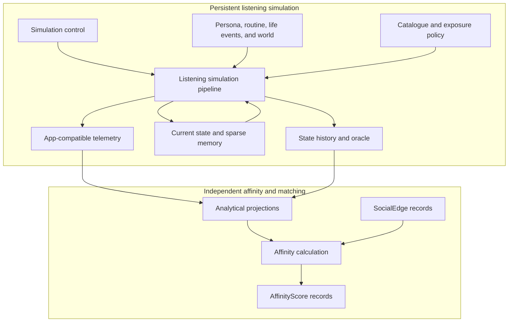
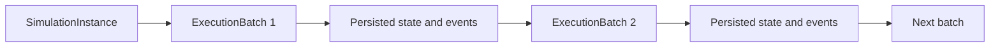
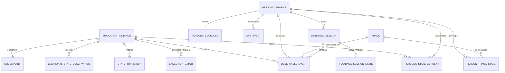
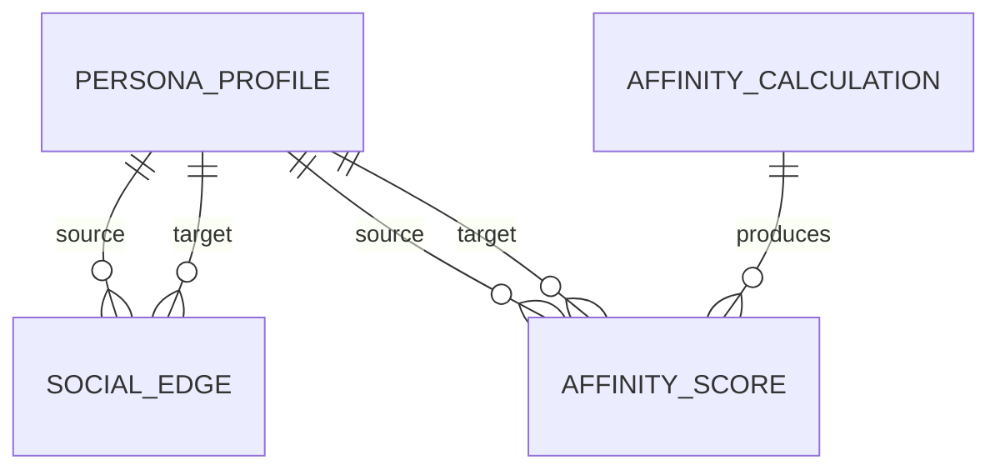
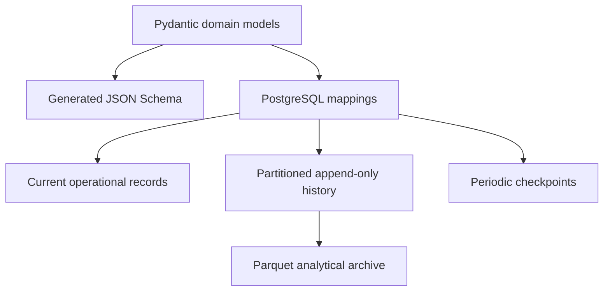
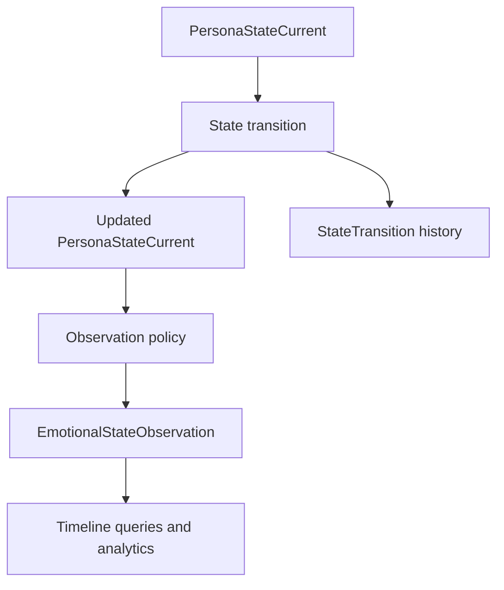
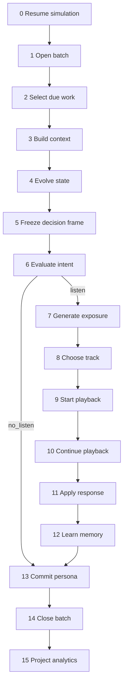

# Vibeout Personas Simulation

## Synthetic Listener Simulator: Architecture and Execution Pipeline

**Status:** Target architecture  
**Version:** 2.0  
**Initial target:** 20,000 persistent synthetic personas  
**Primary database:** PostgreSQL  
**Contract source:** [`schemas/entity-contracts.schema.json`](../schemas/entity-contracts.schema.json)  
**Companion document:** [Entity Usage and Listening Simulation Guide](./entity-usage-and-listening-simulation-guide.md)

This document is normative: it defines **what** the system is and **why**. The companion guide explains **how** each entity is used by the scripts, stage by stage, with a worked example. Both documents share the same entities, stage numbers, and identifiers; when they appear to differ, this document's definitions apply and the guide must be corrected.

---

## 1. Purpose

This document defines the logical entities, persistence model, execution semantics, listening pipeline, tracking system, emotional-history model, audit strategy, and analytical boundaries of Vibeout Personas Simulation.

The system does not generate a fresh collection of disconnected personas on every invocation. It maintains a persistent synthetic population whose state, listening history, and emotional trajectory continue across scheduled executions:

> A persona is a persistent identity. An execution batch advances that identity through a continuous simulated world. Events and observations preserve what happened over time.

At each relevant moment, the simulator combines:

- Stable identity and musical background.
- Current psychological and physiological state.
- Work, family, relationship, and personal events.
- Daily and weekly routines.
- Weather, daylight, season, and broader world conditions.
- Recent listening behaviour and sparse music memory.
- Content exposure through the application.
- Versioned behavioural rules and deterministic randomness.

The input to one behavioural decision is the **decision frame**:

```text
SimulationFrame(t) =
    PersonaProfile
  + PersonaStateCurrent evolved to t (after the pre-listening transition)
  + PersonaSchedule and ScheduleTemplate resolved at t
  + active LifeEvents(t)
  + WorldState(location, t)
  + relevant sparse music memory
  + application context
```

The frame is assembled **after** pre-listening state evolution (stage 4) and references the evolved `state_version`; see [§12](#12-canonical-listening-pipeline). `SocialEdge` is deliberately absent: it belongs to the separate affinity context and never participates in listening decisions.

The simulator emits product-compatible events and internal ground truth that can be analysed independently. It is an experimental system: its outputs demonstrate the consequences of encoded assumptions; they do not prove that those assumptions describe real human populations.

## 2. Architecture Decisions

1. **A persona is a persistent synthetic user.** Their state and history survive scheduled script executions.
2. **A simulation and an execution are different concepts.** `SimulationInstance` identifies a long-lived world; `ExecutionBatch` identifies one invocation that advances it.
3. **PostgreSQL is the initial source of truth.** It stores operational state and queryable history; Parquet is an analytical archive, not the live state store.
4. **JSON entities are logical contracts, not one physical file per persona.** JSON Schema and examples document class shape only.
5. **Pydantic becomes the implementation source of truth.** Generated JSON Schema is checked into the repository for review and contract testing.
6. **Current state is mutable and compact.** `PersonaStateCurrent` is updated with optimistic versioning.
7. **Meaningful history is append-only.** Product events, state transitions, and emotional observations remain queryable over time.
8. **Emotional history has a dedicated read model.** `EmotionalStateObservation` supports timeline queries without copying the entire persona state on every tick.
9. **The listening pipeline does not scan full history on every decision.** Required trends are maintained incrementally in current state.
10. **Decisions are made on evolved state.** The `SimulationFrame` used by intent and choice references the `state_version` produced by pre-listening evolution, never the version read at the start of the work item.
11. **Full state is checkpointed periodically, not copied after every tick.** Checkpoints exist for recovery and replay.
12. **Runtime frames are transient by default.** Full frames and candidate evaluations are retained only by audit policy.
13. **Persona-track and persona-artist memory is sparse.** Records are created only after meaningful contact.
14. **Shared data is not duplicated per persona.** Tracks, artists, weather, policies, and routine templates are referenced by identifier.
15. **Synthetic telemetry uses the application event contract.** Real and synthetic datasets share semantics but remain physically isolated and explicitly labelled by origin.
16. **Observable telemetry and synthetic ground truth are separate.** A product-like consumer cannot access latent state accidentally.
17. **Internal mood and declared mood are distinct.** A mood check-in is observable; latent emotional state belongs to the history and oracle domains.
18. **Simulation is deterministic and versioned.** A selected decision can be replayed from frozen versions, state, and named random streams.
19. **The engine is hybrid discrete-time and discrete-event.** Time advances in ticks, but only due personas and active sessions are evaluated.
20. **Social affinity is a separate bounded context.** `SocialEdge`, `AffinityCalculation`, and `AffinityScore` are retained in this repository but never read by the listening pipeline.
21. **Affinity is sparse.** The system does not materialise the complete persona-pair Cartesian product.

## 3. Goals and Non-Goals

### 3.1 Goals

- Maintain coherent identity and state across months of simulated time.
- Generate application-compatible listening telemetry.
- Query a persona's listening and emotional history by arbitrary time window.
- Preserve stable, slow, daily, session, and event timescales.
- Record non-actions and served exposures as analytical denominators.
- Reproduce selected decisions and recover a simulation after failure.
- Support at least 20,000 personas without millions of small files.
- Process personas concurrently while preserving per-persona order.
- Evaluate whether analytics or recommendation models recover known synthetic patterns.
- Support a separate, reproducible affinity and matching algorithm.
- Keep domain contracts independent from physical database tables.

### 3.2 Non-goals

- Prove real-world psychological relationships from synthetic output.
- Diagnose mental-health conditions.
- Store a natural-language narrative for every simulated moment.
- Persist a complete state snapshot for every persona and tick.
- Evaluate every persona against every track.
- Calculate affinity for every possible pair of personas.
- Let the listening pipeline use `SocialEdge` or `AffinityScore` implicitly.
- Let production-like analytics consume oracle-only variables.
- Use JSON files as the production data store.

## 4. Bounded Contexts and Dependency Direction



The arrow from listening outputs to affinity inputs is one-way.

Allowed dependencies:

- Listening simulation reads control, persona, world, music, and current-memory entities.
- Analytics reads immutable events, transitions, observations, and summaries.
- Affinity reads profiles, `SocialEdge`, and derived behavioural or emotional summaries.

Forbidden dependencies:

- Listening simulation must not read `SocialEdge`.
- Listening simulation must not read `AffinityScore`.
- Affinity must not mutate `PersonaStateCurrent`, `PersonTrackState`, or listening sessions.
- Observable analytics must not read latent oracle fields unless explicitly operating in an evaluation namespace.

## 5. Identity and Execution Semantics

### 5.1 `SimulationInstance`

A `SimulationInstance` represents one continuous synthetic world. It freezes the population, scenario, catalogue, model, policy, schema, and seed lineage used by that world. It owns a logical clock and may have a parent checkpoint when created as an experimental branch.

Status values: `initialising`, `active`, `paused`, `completed`, `failed`, `archived`. Its logical time advances only to a fully committed boundary.

### 5.2 `ExecutionBatch`

An `ExecutionBatch` represents one scheduler or script invocation. It advances a simulation through a bounded logical-time interval (`logical_from` to `logical_to`) and records operational counts, status, and errors.

Status values: `pending`, `running`, `completed`, `partially_failed`, `failed`. Creating a new execution batch does not reset persona state.

### 5.3 Continuous execution



- `logical_time` advances between batches independently from wall-clock time.
- `PersonaStateCurrent` is updated and reused by the next batch.
- Every emitted record retains `simulation_id` and, where the contract permits, `execution_id`.

### 5.4 Experimental branching

An experiment that changes policies or models creates a new `SimulationInstance` from an existing checkpoint rather than rewriting existing history:

```text
canonical simulation
    -> checkpoint at T
        -> branch A with exposure policy v2
        -> branch B with exposure policy v3
```

The original timeline remains immutable. Branch lineage is recorded through `parent_simulation_id` and `parent_checkpoint_id`.

### 5.5 Identifiers and decision lineage

| Identifier | Purpose |
| --- | --- |
| `simulation_id` | One continuous synthetic world. |
| `execution_id` | One periodic batch that advances that world. |
| `scenario_id` | Versioned behavioural and environmental hypothesis. |
| `persona_id` | Persistent synthetic identity; joins profile, current state, memory, history, and summaries. |
| `state_version` | Ordered, idempotent version of current persona state. |
| `decision_sequence` | Ordered number of a behavioural decision within one persona's timeline. |
| `decision_id` | Deterministic identifier of one behavioural decision (defined below). |
| `session_id` | One application listening session. |
| `event_id` | Immutable application-compatible event. |
| `transition_id` | Immutable meaningful state change. |
| `observation_id` | Immutable emotional-history point. |
| `track_id` | Joins catalogue, exposure, memory, and listening activity. |
| `checkpoint_id` | Immutable recovery point. |
| `affinity_calculation_id` | One separate affinity model execution. |

Every behavioural decision receives one deterministic identifier:

```text
decision_id = hash(simulation_id + persona_id + decision_sequence + decision_kind)
```

`decision_id` is carried by every internal record produced for that decision (frame, intent, exposure, evaluations, oracle trace, session, transitions, observations) so causal queries join on an explicit key instead of parsing identifiers or matching timestamps. Observable telemetry keeps the public event contract clean and correlates internally through `simulation_lineage.decision_sequence`. The guide lists which field carries it on each entity: [Guide §17](./entity-usage-and-listening-simulation-guide.md#17-decision-lineage).

`run_id` is not used by the target architecture because it is ambiguous between a world, an experiment, and a single invocation (see [§27](#27-current-iteration) for the interim scripts).

## 6. Logical Entity Catalog

All entities are implemented as typed domain models and exported as JSON Schema. Database mappings may normalise, split, or denormalise these contracts according to access patterns. Field-level definitions live in the schema; how each entity is read and written is described in the [guide](./entity-usage-and-listening-simulation-guide.md).



The affinity context has a separate relationship model:



`SocialEdge` represents an existing or simulated relationship; `AffinityScore` is a calculated result. Keeping them separate prevents a derived score from being mistaken for relationship evidence.

### 6.1 Simulation control

| Entity | Cardinality | Update pattern | Purpose |
| --- | ---: | --- | --- |
| `SimulationConfig` | One per scenario version | Immutable/versioned | Clock, behavioural models, policies, observation policy, and retention policy. |
| `SimulationInstance` | One per continuous world or branch | Lifecycle updates | Freezes lineage and owns logical time. |
| `ExecutionBatch` | One per invocation | Append plus status updates | Records one attempt to advance a simulation. |
| `Checkpoint` | Periodic per simulation | Immutable | Captures recoverable state and stream offsets. |

### 6.2 Persona and life context

| Entity | Cardinality | Update pattern | Purpose |
| --- | ---: | --- | --- |
| `PersonaProfile` | One per persona version | Rare/versioned | Stable identity, psychology, musical identity, and sensitivities. |
| `PersonaStateCurrent` | One per simulation and persona | Mutable/versioned | Latest state and incremental recent-history features. |
| `PersonaSchedule` | One per persona | Slow/versioned | Routine template reference, timezone, and persona-specific overrides. |
| `ScheduleTemplate` | Shared | Immutable/versioned | Reusable probabilistic daily and weekly activity structure. |
| `LifeEvent` | Sparse stream | Append plus lifecycle | Personal event affecting context and state over a time interval. |

### 6.3 Music and shared environment

| Entity | Cardinality | Update pattern | Purpose |
| --- | ---: | --- | --- |
| `WorldState` | One per location and time bucket | Append/upsert | Weather, daylight, season, holiday, and trend context. |
| `Artist` | One per artist version | Rare/versioned | Shared artist identity and catalogue attributes. |
| `Track` | One per track version | Rare/versioned | Musical, lyrical, emotional, and catalogue attributes. |
| `PersonTrackState` | Sparse persona-track pairs | Mutable/versioned | Familiarity, learned affinity, satiation, and associations. |
| `PersonArtistState` | Optional sparse persona-artist pairs | Mutable/versioned | Artist familiarity, loyalty, and satiation. |
| `ExposurePolicy` | One per policy version | Immutable/versioned | Candidate sources, ranking, position effects, and autoplay rules. |

### 6.4 Decision runtime (transient)

These objects exist while one decision is calculated. What survives is decided by the audit mode ([§18](#18-audit-and-retention-policy)).

| Entity | Created at stage | Consumed by | Default persistence (Standard mode) |
| --- | --- | --- | --- |
| `ContextSnapshot` | 3 Build context | Evolve state, intent, playback | Hash and source references; full object sampled. |
| `SimulationFrame` | 5 Freeze decision frame | Intent, exposure, choice, oracle | Transient; sampled or allowlisted. |
| `ListeningIntent` | 6 Evaluate intent | Exposure, choice, playback, response | Compact record for every evaluated opportunity, including `no_listen`. |
| `ExposureSet` | 7 Generate exposure | Choose track | Served items persist as exposure telemetry; unserved longlist sampled. |
| `CandidateEvaluation` | 8 Choose track | Choice sampler, audit | Transient; sampled. |

### 6.5 Sessions, tracking, history, and analytics

| Entity | Cardinality | Persistence | Purpose |
| --- | ---: | --- | --- |
| `PlaybackSessionState` | One per active session | Mutable/versioned while active | Operational playback state: what is playing now, position, queue, next decision. |
| `ListeningSession` | One per session | Lifecycle plus immutable final summary | Queryable session boundary and aggregate. |
| `ObservableEvent` | High | Append-only | Shared application event envelope and typed payload. |
| `StateTransition` | Medium to high | Append-only | Canonical delta, cause, and version change. |
| `EmotionalStateObservation` | Configurable | Append-only | Compact query projection of emotional state over time. |
| `OracleDecisionTrace` | Configurable | Per audit level | Hidden motives, utilities, probabilities, and random decisions. |
| `DailyPersonaSummary` | Up to one per persona/day/version | Derived/upsert | Daily behavioural, musical, and emotional aggregates. |
| `SimulationMetrics` | Multiple per scope/window | Derived/versioned | Cohort, scenario, and simulation metrics. |

### 6.6 Independent affinity context

| Entity | Cardinality | Persistence | Purpose |
| --- | ---: | --- | --- |
| `SocialEdge` | Sparse directed or undirected pair | Current plus optional history | Existing relationship and interaction evidence. |
| `AffinityCalculation` | One per affinity execution | Immutable after completion | Freezes input window, model version, and candidate policy. |
| `AffinityScore` | Sparse calculated pair | Append/versioned | Overall and dimensional compatibility result. |

## 7. JSON Contracts Are Not Physical Files

The repository publishes:

```text
schemas/entity-contracts.schema.json
examples/entity-examples.json
```

These artifacts show the structure of every logical entity and support design review, documentation, and contract tests. They must not result in a runtime layout such as:

```text
personas/persona_000001/profile.json
personas/persona_000001/state.json
personas/persona_000001/history/*.json
personas/persona_000001/tracks/*.json
```

Runtime instances are records in shared stores. One schema file may describe millions of rows.

Until implementation exists, the checked-in schema catalog is the design contract. Once Pydantic models are implemented, CI should generate the schema catalog and fail when generated contracts differ from the committed version unexpectedly.

## 8. Physical Persistence Architecture



### 8.1 Storage classes

| Storage class | Examples | Behaviour |
| --- | --- | --- |
| Mutable operational | `PersonaStateCurrent`, `PlaybackSessionState`, active `ListeningSession`, sparse memory | Upsert with version checks. |
| Immutable/versioned | Profiles, configuration, policies, catalogue versions | Insert a new version; never overwrite history. |
| Append-only history | Telemetry, transitions, emotional observations | Partition by simulation time and identifier. |
| Shared reference | Tracks, artists, weather, schedule templates | Store once and join by identifier. |
| Audit-controlled | Frames, snapshots, intents, candidate evaluations, oracle traces | Retain according to the audit mode. |
| Analytical archive | Closed historical partitions | Export to compressed Parquet when appropriate. |

### 8.2 PostgreSQL as source of truth

PostgreSQL stores both mutable operational state and append-only history for the initial scale.

| Namespace | Contents |
| --- | --- |
| `simulation_control` | Configurations, simulation instances, execution batches, checkpoints, model versions. |
| `simulation_core` | Profiles, current states, schedules, life events, catalogue references, sparse music memory, active playback. |
| `synthetic_telemetry` | Product-compatible events and listening sessions. |
| `simulation_history` | State transitions, emotional observations, daily summaries. |
| `simulation_oracle` | Listening intents, hidden decision traces, and sampled frames. |
| `simulation_affinity` | Social edges, affinity calculations, affinity scores. |

Production real-user telemetry must live outside these synthetic namespaces, preferably in a separate database or dataset. Sharing a contract does not justify sharing unrestricted storage.

### 8.3 Storage mapping

| Logical entity | Suggested physical representation | Main access pattern |
| --- | --- | --- |
| `PersonaProfile` | Versioned relational row; bounded JSONB sections where appropriate | Get one persona version; cohort filters. |
| `PersonaStateCurrent` | Relational row keyed by `(simulation_id, persona_id)` | Point read and optimistic update. |
| `PersonaSchedule` | Relational row plus structured overrides | Resolve routine for one persona. |
| `WorldState` | Time-bucketed relational rows | Location and time range. |
| `Track`, `Artist` | Versioned relational catalogue tables | Candidate lookup and feature filtering. |
| `PersonTrackState` | Sparse relational table | Persona plus selected track IDs. |
| `PlaybackSessionState` | Relational row keyed by `(simulation_id, persona_id)` where `status <> 'ended'` | "What is playing now" point read. |
| `ObservableEvent` | Time-partitioned append-only table | Persona/session timeline and aggregates. |
| `StateTransition` | Time-partitioned append-only table | Replay by persona and time. |
| `EmotionalStateObservation` | Time-partitioned append-only table | Persona emotional timeline. |
| `OracleDecisionTrace` | Separate partitioned table | Debug by decision or allowlisted persona. |
| `Checkpoint` | Metadata row plus snapshot object reference | Recovery by simulation and time. |
| `AffinityScore` | Sparse relational table keyed by calculation and pair | Top matches and pair lookup. |

### 8.4 Parquet analytical archive

Closed historical partitions may be exported to compressed Parquet for large scans, offline notebooks, and cheaper retention. DuckDB, Polars, Spark, or a warehouse may query these files. Parquet is downstream of PostgreSQL; it is not used to coordinate concurrent current-state updates.

### 8.5 Why not NoSQL initially

The dominant access patterns depend on relationships, time ranges, idempotent writes, ordering, transactions, and constrained joins. PostgreSQL handles those directly while still allowing controlled flexible fields through JSONB. A document database would duplicate relational links and would not remove the need for an analytical event store. It can be reconsidered only after measured access patterns reveal a specific limitation.

## 9. Application-Compatible Telemetry Contract

The simulator exposes two deliberately different views of the same persona.

### 9.1 Observable application view

This contains only what Vibeout could receive through its product telemetry contract:

- Session start and end.
- Content exposure and position.
- Search, browse, and navigation actions.
- Track start, progress, pause, resume, seek, skip, completion, and repeat.
- Like, save, share, and other explicit feedback.
- A mood check-in only when the product explicitly asks the user.

### 9.2 Synthetic ground-truth view

This contains variables known only because the user is simulated:

- Latent emotional state.
- Active listening motive and desired emotion.
- Candidate utilities and choice probabilities.
- Music-induced emotional response.
- Random draws and model decisions.

Systems evaluated as if they were production systems must not read this view ([§14](#14-output-separation)).

### 9.3 Event envelope

Every `ObservableEvent` includes:

- `event_id`, `event_name`, `event_version`
- `occurred_at`, `ingested_at`
- `actor_id` (maps to `persona_id` for synthetic telemetry)
- `session_id`, when applicable
- `track_id`, when applicable
- `data_origin` (always `synthetic` for simulator output)
- `idempotency_key`
- `simulation_lineage` with `simulation_id`, `execution_id`, and `decision_sequence`
- `application_context`: device, operating system, app version, surface, request, and network
- a typed `payload`

### 9.4 Principal event families

- Session: started, resumed, ended.
- Discovery: feed viewed, search submitted, playlist opened.
- Exposure: content served, recommendation shown, autoplay candidate served.
- Playback: track started, progress, paused, resumed, sought, skipped, completed, repeated.
- Feedback: liked, unliked, saved, removed, shared.
- Mood: explicit check-in submitted, changed, or dismissed when supported by the product.

Only served items become observable exposure events. Internal candidate longlists remain transient or oracle-only.

### 9.5 Real and synthetic compatibility

The same event names, payload meanings, and versions are used by real and synthetic producers. Differences are expressed through provenance, never through silently different semantics. The same analytics queries can therefore operate on either dataset, synthetic events can test ingestion and metric definitions, and behavioural comparisons need no translation layer.

Safety boundary:

- Real and synthetic records are physically separated.
- Every event includes `data_origin`.
- Dashboards and experiments declare an allowed origin explicitly.
- Synthetic identifiers must never collide with production user identifiers.

## 10. Emotional State and History

### 10.1 Three representations



| Representation | Authoritative for | Query pattern |
| --- | --- | --- |
| `PersonaStateCurrent` | The next behavioural decision | One row by simulation and persona. |
| `StateTransition` | Why and how state changed | Ordered deltas by persona and time. |
| `EmotionalStateObservation` | Emotional journey analysis | Time range by persona or cohort. |

This is intentional CQRS-style duplication: the write model and the historical read model optimise different workloads.

### 10.2 `PersonaStateCurrent`

The current row contains the current emotional vector and dominant label; energy, fatigue, stress, attention, and satisfaction; current activity and active goals and life events; latest session and observation references; the next scheduled processing time; the state version; and incremental recent-history features such as trend, volatility, and time in state. It does not contain an unbounded array of past observations.

### 10.3 `StateTransition`

A transition records the previous and resulting state versions, timestamp, cause category and source identifiers, compact field-level changes (`StateChange`), the behavioural model version, and optional links to an application event or oracle decision. Transitions are canonical for replay. No-op evaluations are omitted or aggregated.

### 10.4 `EmotionalStateObservation`

An observation is a compact projection containing selected emotional and related variables, context references, and an observation reason. The reasons are exactly the schema's `observation_reason` values:

| `observation_reason` | Emitted when |
| --- | --- |
| `heartbeat` | A configured simulated-time interval elapses during inactivity. |
| `state_threshold` | A state change exceeds a configured threshold. |
| `session_start` | A listening session opens (stage 6), before any playback. |
| `session_end` | A listening session closes. |
| `life_event_boundary` | A life event starts, changes, or ends. |
| `mood_check_in` | The persona submits an explicit mood check-in. |
| `forensic` | Forensic audit mode captures additional points. |

A sensible initial heartbeat is once per simulated hour, plus event-triggered observations; it remains scenario-configurable. At 20,000 personas:

```text
hourly heartbeat     = 20,000 × 24 =   480,000 maximum heartbeat observations/day
15-minute heartbeat  = 20,000 × 96 = 1,920,000 maximum heartbeat observations/day
```

The default should therefore be chosen from analytical requirements, not from tick frequency.

### 10.5 Historical influence on new decisions

The listening pipeline must not query a persona's entire emotional history on every tick. If recent trajectory affects behaviour, an incremental feature reducer updates bounded fields in `PersonaStateCurrent`, for example: recent valence and arousal trend, emotional volatility over a horizon, duration of the current dominant state, recent regulation success rate, and time since the last meaningful change. The full observation series remains available for offline analysis.

### 10.6 Declared versus latent mood

An explicit mood check-in is an `ObservableEvent`: what the user chose to report. `EmotionalStateObservation` is the simulator's internal state. A reporting model may introduce noise, concealment, or categorical compression, so a check-in need not equal latent state. This separation is essential for evaluating mood inference honestly.

## 11. Simulation Time Model

The engine combines a logical clock with a due-event queue.

- `tick_minutes` defines the maximum evaluation interval.
- `next_scheduled_event_at` identifies when a persona must next be processed.
- Playback sessions schedule their own progress and completion decisions.
- Routine and life-event boundaries schedule state evaluations.
- Heartbeat observations may schedule lightweight history work.
- Long inactive intervals can be advanced through one transition calculation.

A persona is due when a routine boundary is reached, a life event begins, changes, or ends, a listening opportunity is due, an active session reaches a decision point, a heartbeat observation is due, or a checkpoint or slow-learning update is required.

Script frequency and simulation tick size are independent. One execution may advance several ticks, and one long playback session may schedule multiple event-level decisions inside a tick.

## 12. Canonical Listening Pipeline

These sixteen stages are the single reference numbering for scripts, tests, and documentation. The [guide §14](./entity-usage-and-listening-simulation-guide.md#14-entity-touches-per-pipeline-stage) lists exactly which entities each stage reads and writes, using the same numbers and names.



| # | Stage | Scope | Principal result |
| ---: | --- | --- | --- |
| 0 | Resume simulation | Process | Validated versions, restored state, named random streams |
| 1 | Open batch | Process | `ExecutionBatch` (`running`) |
| 2 | Select due work | Process | Due-persona work list |
| 3 | Build context | Persona | `ContextSnapshot` |
| 4 | Evolve state | Persona | Evolved state; optional `StateTransition` and observation |
| 5 | Freeze decision frame | Persona | `SimulationFrame` on the evolved `state_version` |
| 6 | Evaluate intent | Persona | `ListeningIntent`; on `listen`, an open `ListeningSession` |
| 7 | Generate exposure | Persona | `ExposureSet`; exposure events for served items |
| 8 | Choose track | Persona | `CandidateEvaluation`s, `OracleDecisionTrace`, selected track or no action |
| 9 | Start playback | Persona | `PlaybackSessionState`; `track_started` event |
| 10 | Continue playback | Persona | Progress, pause, skip, and completion events |
| 11 | Apply response | Persona | Post-listening `StateTransition`; optional observation |
| 12 | Learn memory | Persona | Sparse `PersonTrackState` and optional `PersonArtistState` upserts |
| 13 | Commit persona | Persona | Atomic commit of state, history, memory, and next due time |
| 14 | Close batch | Process | Final `ExecutionBatch` status; logical clock; optional `Checkpoint` |
| 15 | Project analytics | Asynchronous | `DailyPersonaSummary`, `SimulationMetrics` |

### Stage 0 — Resume simulation

**Reads:** `SimulationConfig`, `SimulationInstance`, population and profile versions, catalogue and policy versions, latest compatible `Checkpoint`.  
**Processing:** validate schema and model compatibility; restore or validate current state; initialise deterministic named random streams; confirm the logical-time boundary.  
**Writes:** initial state only for a new simulation; recovery metadata when resuming from a checkpoint.

### Stage 1 — Open batch

**Reads:** current logical time, requested advance boundary.  
**Processing:** create the `ExecutionBatch` with frozen input versions and its `logical_from`/`logical_to` window; mark it `running`.  
**Writes:** `ExecutionBatch`.

### Stage 2 — Select due work

**Reads:** `PersonaStateCurrent.next_scheduled_event_at`, active `PlaybackSessionState` decision points, scheduler queue.  
**Processing:** select due personas and group work by persona so one persona is never processed concurrently.  
**Writes:** scheduler state only.

### Stage 3 — Build context

**Reads:** `PersonaProfile`, `PersonaStateCurrent`, `PersonaSchedule` and `ScheduleTemplate`, active `LifeEvent` records, `WorldState`, application context.  
**Processing:** resolve activity, location, company, privacy, attention, time availability, and music control; apply persona sensitivities to external conditions; record exact source identifiers and versions.  
**Produces:** `ContextSnapshot`.  
**Explicit exclusion:** no `SocialEdge` or `AffinityScore` read.

### Stage 4 — Evolve state

**Reads:** previous current state, `ContextSnapshot`, elapsed simulated time, active life events, model version.  
**Processing:** evolve emotional and physiological variables; apply baseline reversion, inertia, circadian effects, and life-event pressure; update incremental emotional-history features; decide whether the change is meaningful.  
**Produces:** evolved in-memory state; a `StateTransition` with cause `pre_listening_time_evolution` when the change is meaningful; an `EmotionalStateObservation` when a trigger fires.

### Stage 5 — Freeze decision frame

**Reads:** evolved state, `ContextSnapshot`, relevant memory references.  
**Processing:** assemble the `SimulationFrame` that binds profile version, the **evolved** `state_version`, context, active life events, and relevant track-state references; compute its input hash; assign the `decision_id`.  
**Produces:** `SimulationFrame`. If state version 193 evolved to 194 in stage 4, the frame references 194.

### Stage 6 — Evaluate intent

**Reads:** `SimulationFrame`, habit and availability state, current activity and application access.  
**Processing:** evaluate whether listening is possible and desired; sample the outcome deterministically; derive motive, desired emotion, time budget, and control mode.  
**Produces:** `ListeningIntent`. When `selected_outcome = listen`, the persona opens the app: a `ListeningSession` (`active`) and a `session_started` event are created, and a `session_start` observation is captured when the policy requires it. Exposure always happens inside this session.  
**No-listen path:** when `selected_outcome = no_listen`, keep the intent according to the audit mode, keep any stage-4 transition or observation, skip stages 7–12 (no session, exposure, playback, or memory records unless the product actually displayed content), schedule the next due time, and continue at stage 13.

### Stage 7 — Generate exposure

**Reads:** `ListeningIntent`, `ExposurePolicy`, track catalogue and artist data, sparse persona-track and persona-artist memory, application surface and request context.  
**Processing:** select eligible candidate sources; apply availability and policy constraints; rank or arrange candidates; separate generated candidates from actually served items. Exposure policy represents product visibility and stays separate from intrinsic persona preference.  
**Produces:** `ExposureSet` (with the open `session_id`); observable exposure events for served items only.

### Stage 8 — Choose track

**Reads:** `ExposureSet`, `SimulationFrame`, `ListeningIntent`, relevant memory records, choice model and random stream.  
**Processing:** calculate candidate utilities and their interpretable components; include an internal no-action alternative; apply position and platform effects; sample the selected action deterministically.  
**Produces:** `CandidateEvaluation` per candidate; `OracleDecisionTrace` referencing the stage-5 frame; the selected track or no action.

### Stage 9 — Start playback

**Reads:** selected track, open `ListeningSession`, application context.  
**Processing:** create the `PlaybackSessionState`; emit `track_started` only after the corresponding served exposure; update the session's counters.  
**Produces:** `PlaybackSessionState` (`active`); `track_started` `ObservableEvent`.

### Stage 10 — Continue playback

**Reads:** active `PlaybackSessionState`, attention, time budget, application context.  
**Processing:** emit progress, pause, resume, seek, skip, completion, and repeat actions; schedule future playback decisions; allow session exits.  
**Produces:** playback `ObservableEvent`s; updated `PlaybackSessionState`; `ListeningSession` lifecycle updates and, on exit, its final summary plus a `session_end` observation when required.

### Stage 11 — Apply response

**Reads:** playback outcome, track attributes, pre-listening state and intent, music sensitivity and regulation strategy.  
**Processing:** update emotion, satisfaction, fatigue, and regulation outcome; maintain recent emotional features; evaluate observation triggers.  
**Produces:** `StateTransition` with cause `post_listening_response`; `EmotionalStateObservation` when a trigger fires.

### Stage 12 — Learn memory

**Reads:** exposure and playback events, existing `PersonTrackState` and optional `PersonArtistState`.  
**Processing:** update familiarity, satiation, emotional associations, learned affinity, counts, and last-contact times; create records only after qualifying contact.  
**Writes:** sparse memory upserts.

### Stage 13 — Commit persona

**Processing:** apply the transaction in [§13](#13-transaction-ordering-and-idempotency): append events, transitions, and observations; upsert memory, playback, and session rows; update `PersonaStateCurrent` with a version check; schedule the next due time.  
**Writes:** all records of the work item, atomically.

### Stage 14 — Close batch

**Processing:** verify processed, deferred, retried, and failed counts; advance the simulation logical clock only to a committed boundary; create a `Checkpoint` if policy requires it; mark the batch `completed`, `partially_failed`, or `failed`.

### Stage 15 — Project analytics

**Reads:** immutable telemetry, transitions and observations, completed sessions.  
**Writes:** `DailyPersonaSummary`, `SimulationMetrics`, exportable analytical partitions. Runs asynchronously, outside the persona transaction. Analytics never mutates canonical history.

## 13. Transaction, Ordering, and Idempotency

Each due-persona work item is the primary consistency boundary. Within one transaction or transactional-outbox unit:

1. Read `PersonaStateCurrent` and retain its `state_version`.
2. Resolve context and compute deterministic outputs.
3. Append new events, transitions, and observations.
4. Upsert sparse memory, `PlaybackSessionState`, and `ListeningSession`.
5. Update `PersonaStateCurrent` with `WHERE state_version = previous_version`, incrementing the version.
6. Schedule the next due time.
7. Commit all records together.

If the version check fails, discard the calculated outputs and retry the work item from the newly committed state.

Every emitted record has a deterministic idempotency key derived from stable identifiers:

```text
simulation_id
+ execution_id
+ persona_id
+ decision_sequence
+ record_kind
```

Unique constraints prevent a retried batch from duplicating application events or state changes. A retry reproduces the same identifiers and the same random outcomes.

## 14. Output Separation

### 14.1 Observable namespace

Contains only events that a real application could observe ([§9.1](#91-observable-application-view)), including explicit user-reported mood when enabled. It must not contain true latent emotional state, hidden motive or desired emotion, candidate utilities, unserved candidate longlists, or random draws.

### 14.2 State and history namespace

Contains operational state, transitions, sparse memory, and emotional observations required to continue and analyse the synthetic user. These records are internal to the simulator even when analysts may query them.

### 14.3 Oracle namespace

Contains hidden decision information ([§9.2](#92-synthetic-ground-truth-view)) used to explain behaviour and measure how accurately downstream systems infer synthetic ground truth. Oracle access is explicitly permissioned or exposed through evaluation-only datasets.

## 15. Affinity and Matching Pipeline

Affinity is a separate algorithm inside the same repository, not a stage of the listening pipeline.

**Inputs:** versioned `PersonaProfile` data; `SocialEdge` relationship and interaction evidence; derived musical and emotional-pattern summaries; a candidate-pair policy; the affinity model version and feature definition. Raw histories should be reduced into versioned feature snapshots before large calculations.

**Processing:**

1. Open an `AffinityCalculation`.
2. Generate a sparse candidate-pair set.
3. Resolve versioned features for both personas.
4. Calculate overall and dimensional scores.
5. Persist results with input fingerprints and model version.

**Outputs:** `AffinityScore` records with overall, musical, emotional-pattern, behavioural-rhythm, and optional social-context compatibility, a confidence or coverage indicator, and explanation feature references.

**Boundary guarantee:** affinity outputs do not feed the listening simulator. Introducing that feedback would require an explicit architecture decision, a versioned adapter, and causal controls to prevent a hidden recommendation feedback loop.

## 16. Checkpoint and Replay Strategy

A checkpoint captures enough state to resume without replaying from simulation time zero: current persona states and versions, active playback sessions, sparse persona-track and persona-artist memory, the scheduler queue or derivable scheduler state, the logical clock, the last committed event offsets, and schema, model, policy, and catalogue fingerprints.

Replay procedure:

1. Load the latest compatible checkpoint before the target time.
2. Restore frozen versions and named random streams.
3. Reapply ordered transitions and events or rerun deterministic decisions.
4. Compare resulting state hashes with recorded boundaries.

Checkpoints are recovery artifacts, not the source for emotional-timeline queries.

## 17. Deterministic Randomness

Randomness is derived from stable namespaces, not from worker order. Streams include state evolution, listening opportunity, exposure generation, candidate choice, playback actions, emotional response, and mood self-reporting. A stream derives its seed from:

```text
simulation_seed
+ persona_id
+ logical_time_bucket
+ decision_sequence
+ stream_name
```

Parallel scheduling must not change a persona's results.

## 18. Audit and Retention Policy

### 18.1 Retention modes

The scenario's retention mode maps to the schema's `audit_level` values: **Lean → `minimal`, Standard → `compact`, Forensic → `full`**.

| Data | Lean (`minimal`) | Standard (`compact`) | Forensic (`full`) |
| --- | --- | --- | --- |
| App-compatible telemetry | All | All | All |
| Session summaries | All | All | All |
| State transitions | Meaningful | Meaningful | All evaluated changes |
| Emotional observations | Policy triggers | Policy triggers | Policy triggers plus `forensic` points |
| `ListeningIntent` | Folded into the oracle trace | Compact, every evaluated opportunity | Full |
| `OracleDecisionTrace` | Minimal | Compact, all decisions | Full, all decisions |
| `ContextSnapshot` and `SimulationFrame` | Hash and references | Sampled/allowlisted | Selected personas/windows in full |
| Unserved candidates and `CandidateEvaluation` | None | Sampled | Selected decisions in full |
| Checkpoints | Periodic | Periodic | Before and after target windows |

### 18.2 Observation policy

The emotional-history policy is independent from the tick interval. It configures the heartbeat interval, change thresholds, required boundaries, included fields, retention and archive policy, and persona or scenario allowlists.

### 18.3 Historical retention

Canonical histories are normally retained for the life of the simulation experiment. Closed PostgreSQL partitions may be exported to Parquet and moved to cheaper storage when interactive access is no longer required. Derived projections may be rebuilt and can have shorter retention if their definitions and source histories remain available.

## 19. Scaling Analysis

**Profiles are not the dominant volume.** Twenty thousand profile and current-state rows are small for PostgreSQL. Growth is dominated by playback and exposure events, heartbeat frequency, transition granularity, oracle detail, and candidate-evaluation retention.

**Avoid tick snapshots.** At 20,000 personas and 96 fifteen-minute ticks per day:

```text
20,000 × 96 = 1,920,000 persona-ticks/day
```

Persisting a full document per tick would create high write volume even when most states barely changed. Current state plus meaningful transitions, configurable observations, and checkpoints preserves history more efficiently.

**Sparse persona-track state.** For 20,000 personas and a 100,000-track catalogue:

```text
20,000 × 100,000 = 2,000,000,000 possible persona-track pairs
```

Only encountered tracks receive `PersonTrackState` records.

**Sparse affinity.** Twenty thousand personas produce:

```text
20,000 × 19,999 / 2 = 199,990,000 undirected persona pairs
```

Affinity calculation must use candidates, cohorts, approximate neighbours, explicit requests, or other pruning rather than storing every pair.

## 20. Partitioning and Indexing Direction

Exact DDL belongs to the implementation phase, but the architecture expects:

- Time-range partitioning for `ObservableEvent`, `StateTransition`, and `EmotionalStateObservation`.
- Simulation identifier included in partition-local indexes.
- Composite indexes for `(simulation_id, persona_id, occurred_at)` or equivalent.
- Session indexes for timeline reconstruction.
- Unique idempotency keys for append-only records.
- `decision_id` indexes on internal decision records.
- Sparse memory keys on `(simulation_id, persona_id, track_id)` and the artist equivalent.
- Affinity indexes that support top matches by source persona and calculation version.

Partition duration should be selected from measured event volume, not fixed prematurely.

## 21. Analytical Metrics and Required Inputs

| Metric family | Required observable inputs | Optional internal inputs |
| --- | --- | --- |
| Musical diversity and entropy | Completed or duration-weighted listening events | None |
| Artist and track affinity | Exposure plus action history | Learned persona-track state |
| Novelty versus familiarity | Exposure and listening events | Synthetic familiarity state |
| Context-conditioned preference | Event context and track features | Latent intent |
| Emotional congruence | Mood check-ins when available | Emotional observations and track emotion |
| Regulation success | Pre/post declared mood when available | Pre/post latent emotional state |
| Habit and routine | Session and listening timestamps | Schedule and active context |
| Identity drift | Longitudinal listening history | Musical identity and learned affinities |
| Exposure acceptance | Served exposures and subsequent actions | Candidate utilities for evaluation only |
| Mood inference gap | Observable telemetry and check-ins | Latent emotional observations |

Every derived metric records its definition version, source window, simulation identifier, and included data origin.

## 22. Parallel Execution Model

- Partition due work by `persona_id` so one persona is never updated concurrently within the same simulation.
- Use optimistic state versions to detect stale work.
- Keep random streams independent from worker count and ordering.
- Append events with unique deterministic idempotency keys.
- Close an execution batch only after all work items are committed, explicitly deferred, or marked failed.
- Advance the simulation clock only to a fully committed boundary.
- Retry one persona work item without rerunning unrelated personas.

The first implementation may be a single process. These constraints should still be present so later parallelisation does not change behaviour.

## 23. Data Integrity Invariants

Scripts enforce these from the first implementation:

1. One `PersonaStateCurrent` exists for every active `(simulation_id, persona_id)` pair.
2. `state_version` increases monotonically by committed transition order.
3. The `SimulationFrame` referenced by intent, choice, and `OracleDecisionTrace` carries the evolved `state_version` actually used by those decisions.
4. Every internal decision record of one decision shares the same `decision_id`.
5. Every synthetic observable event references one simulation and execution and has `data_origin = synthetic`.
6. Synthetic and real identifiers cannot collide within shared analytical tooling.
7. Exposure events carry the `session_id` of an already open `ListeningSession`.
8. A `track_started` event cannot precede the corresponding served exposure.
9. A `session_start` observation, when required by policy, is captured before playback starts.
10. An active `PlaybackSessionState.current_track_id` matches the latest committed playback event of its session.
11. A completed session ends at or after it starts.
12. An emotional observation timestamp cannot exceed the simulation's committed logical time.
13. A state transition references the previous and resulting state versions.
14. A mood check-in remains distinct from internal emotional state; latent mood never appears in observable telemetry.
15. Persona-track and persona-artist state exist only after qualifying contact.
16. A retried work item reproduces the same identifiers and random outcomes.
17. Listening code has no dependency on affinity repositories or models.
18. An affinity score references a completed or identifiable calculation version.
19. A checkpoint records compatible schema and model fingerprints.
20. Analytics never mutates canonical events, transitions, or observations.

## 24. Target Repository Structure

This is the target layout; the [README](../README.md) shows what exists today.

```text
vibeout-personas-simulation/
├── README.md
├── pyproject.toml
├── configs/
│   ├── scenarios/
│   ├── policies/
│   └── retention/
├── schemas/
│   ├── entity-contracts.schema.json
│   └── persona-unified-schema.json
├── examples/
│   └── entity-examples.json
├── docs/
│   ├── vibeout-synthetic-personas.md
│   ├── synthetic-listener-simulation-architecture.md
│   └── entity-usage-and-listening-simulation-guide.md
├── src/vo_personas_simulation/
│   ├── domain/
│   │   ├── control/
│   │   ├── persona/
│   │   ├── music/
│   │   ├── telemetry/
│   │   ├── history/
│   │   └── affinity/
│   ├── generation/
│   ├── simulation/
│   │   ├── scheduler/
│   │   ├── context/
│   │   ├── state/
│   │   ├── intent/
│   │   ├── exposure/
│   │   ├── choice/
│   │   └── playback/
│   ├── telemetry/
│   ├── history/
│   ├── affinity/
│   ├── storage/
│   │   ├── postgres/
│   │   └── parquet/
│   └── analytics/
├── migrations/
├── tests/
│   ├── unit/
│   ├── integration/
│   ├── contract/
│   ├── replay/
│   └── statistical/
└── data/
    ├── fixtures/
    └── generated/
```

## 25. Implementation Order

This is the single implementation order for the project. Build one complete, inspectable path first: **one persona, a small catalogue, and one due decision through stages 0–15**, preserving every contract boundary. Only then add more psychological parameters, richer ranking, parallel workers, or 20,000 personas.

1. Implement common identifiers (including `decision_sequence` and `decision_id`), timestamps, version metadata, and `EmotionVector`.
2. Implement Pydantic domain models for the first-version entities and generate the JSON Schema catalog.
3. Define PostgreSQL mappings and migrations for control, current state, and history.
4. Implement repositories for profiles, current state, schedules, life events, world state, catalogue, and policy.
5. Implement `SimulationInstance`, `ExecutionBatch`, the logical clock, the scheduler, and idempotency boundaries (stages 0–2, 13–14).
6. Implement context building, pre-listening evolution, transitions, and emotional observations (stages 3–4).
7. Implement the decision frame and listen/no-listen intent, including session opening (stages 5–6).
8. Implement a small exposure and candidate-choice model (stages 7–8).
9. Implement playback, sessions, and telemetry (stages 9–10).
10. Implement post-listening response and sparse music memory (stages 11–12).
11. Implement the current-track and mood-explanation queries ([guide §16](./entity-usage-and-listening-simulation-guide.md#16-how-to-retrieve-the-current-track-and-its-causal-mood)).
12. Implement checkpoints and deterministic replay tests.
13. Build analytical projections (stage 15).
14. Scale-test 20,000 persistent personas and tune partitioning from evidence.
15. Implement `SocialEdge`, sparse candidate generation, and the independent affinity pipeline.

**First-version entities:** `SimulationConfig`, `SimulationInstance`, `ExecutionBatch`, `Checkpoint`, `PersonaProfile`, `PersonaStateCurrent`, `PersonaSchedule`, `ScheduleTemplate`, `LifeEvent`, `WorldState`, `Artist`, `Track`, `PersonTrackState`, `ExposurePolicy`, `ContextSnapshot`, `SimulationFrame`, `ListeningIntent`, `ExposureSet`, `CandidateEvaluation`, `PlaybackSessionState`, `ListeningSession`, `ObservableEvent`, `StateTransition`, `EmotionalStateObservation`, and `OracleDecisionTrace`. `PersonArtistState` may follow once track-level memory is stable. The affinity entities exist in the schema but are implemented last.

## 26. Final Persistence Summary

### Always retain

- Versioned simulation configuration and lineage.
- Persona profile versions.
- Latest current state.
- App-compatible observable events.
- Meaningful state transitions.
- Policy-selected emotional observations.
- Completed session summaries.
- Sparse music memory.
- Execution metadata and periodic checkpoints.

### Update in place with version control

- `PersonaStateCurrent`
- Active `PlaybackSessionState`
- Active `ListeningSession`
- `PersonTrackState`
- `PersonArtistState`
- Incremental recent-history features

### Append as immutable history

- `ObservableEvent`
- `StateTransition`
- `EmotionalStateObservation`
- Completed session summaries
- Life-event changes
- Affinity calculations and score versions

### Retain according to the audit mode

- `ListeningIntent`
- `OracleDecisionTrace`
- `ContextSnapshot` and `SimulationFrame`
- Full `ExposureSet`, including unserved candidates
- `CandidateEvaluation`

### Derive asynchronously

- `DailyPersonaSummary`
- `SimulationMetrics`
- Affinity feature snapshots

### Aggregate or omit

- Inactive ticks
- Repeated no-op evaluations
- High-frequency values below observation thresholds
- Full persona-by-track, persona-by-artist, and persona-by-persona Cartesian products

This model makes each synthetic persona queryable like a persistent application user while preserving the internal state required for realistic simulation, deterministic replay, and future affinity analysis.

## 27. Current Iteration

This document describes the target. Until the PostgreSQL implementation exists, the project runs in an interim mode:

- Scripts are executed manually from the terminal (`scripts/generate_personas.py`, `scripts/harvest_catalog.py`, `scripts/simulate_listening.py`).
- They write JSONL, JSON, and local SQLite files under `data/`.
- The explorer (`explorer/server`, a Next.js API, and `explorer/client`, a React + Vite dashboard) reads those generated files to display them. Buttons that trigger simulations from the UI come in a later iteration.
- The interim scripts' `run_id` plays the role of `execution_id` until `ExecutionBatch` is implemented.

The interim files follow the target concepts (persistent personas, recomputable moments, sparse music memory, explained choices) so they can be migrated to the target stores without changing the model.
