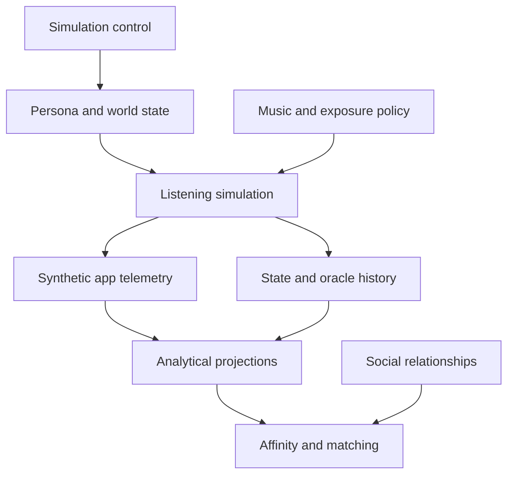

# Synthetic Listener Simulator

## Data Architecture and Execution Pipeline

**Status:** Proposed architecture  
**Version:** 2.0  
**Initial target:** 20,000 persistent synthetic personas  
**Primary database:** PostgreSQL  
**Domain:** Everyday life, music selection, application behaviour, and emotional response

## 1. Purpose

This document defines the logical entities, persistence model, execution semantics, listening pipeline, tracking system, emotional-history model, audit strategy, and analytical boundaries of VO Personas Simulation.

The system does not generate a fresh collection of disconnected personas on every invocation. It maintains a persistent synthetic population whose state, listening history, and emotional trajectory continue across scheduled executions.

At each relevant moment, the simulator combines:

- Stable identity and musical background.
- Current psychological and physiological state.
- Work, family, relationship, and personal events.
- Daily and weekly routines.
- Weather, daylight, season, and broader world conditions.
- Recent listening behaviour and sparse music memory.
- Content exposure through the application.
- Versioned behavioural rules and deterministic randomness.

It then emits product-compatible events and internal ground truth that can be analysed independently.

The simulator is an experimental system. Its outputs demonstrate the consequences of encoded assumptions; they do not prove that those assumptions describe real human populations.

## 2. Final Architecture Decisions

1. **A persona is a persistent synthetic user.** Their state and history survive scheduled script executions.
2. **A simulation and an execution are different concepts.** `SimulationInstance` identifies a long-lived world; `ExecutionBatch` identifies one invocation that advances it.
3. **PostgreSQL is the initial source of truth.** It stores operational state and queryable history; Parquet is an analytical archive, not the live state store.
4. **JSON entities are logical contracts, not one physical file per persona.** JSON Schema and examples document class shape only.
5. **Pydantic becomes the implementation source of truth.** Generated JSON Schema is checked into the repository for review and contract testing.
6. **Current state is mutable and compact.** `PersonaStateCurrent` is updated with optimistic versioning.
7. **Meaningful history is append-only.** Product events, state transitions, and emotional observations remain queryable over time.
8. **Emotional history has a dedicated read model.** `EmotionalStateObservation` supports timeline queries without copying the entire persona state on every tick.
9. **The listening pipeline does not scan full history on every decision.** Required trends are maintained incrementally in current state.
10. **Full state is checkpointed periodically, not copied after every tick.** Checkpoints exist for recovery and replay.
11. **Runtime frames are transient by default.** Full frames and candidate evaluations are retained only by audit policy.
12. **Persona-track and persona-artist memory is sparse.** Records are created only after meaningful contact.
13. **Shared data is not duplicated per persona.** Tracks, artists, weather, policies, and routine templates are referenced by identifier.
14. **Synthetic telemetry uses the application event contract.** Real and synthetic datasets share semantics but remain physically isolated and explicitly labelled by origin.
15. **Observable telemetry and synthetic ground truth are separate.** A product-like consumer cannot access latent state accidentally.
16. **Internal mood and declared mood are distinct.** A mood check-in is observable; latent emotional state belongs to the oracle/history domain.
17. **Simulation is deterministic and versioned.** A selected decision can be replayed from frozen versions, state, and named random streams.
18. **The engine is hybrid discrete-time and discrete-event.** Time advances in ticks, but only due personas and active sessions are evaluated.
19. **Social affinity is a separate bounded context.** `SocialEdge`, `AffinityCalculation`, and `AffinityScore` are retained in this repository but never read by the listening pipeline.
20. **Affinity is sparse.** The system does not materialise the complete persona-pair Cartesian product.

## 3. Goals and Non-Goals

### 3.1 Goals

- Maintain coherent identity and state across months of simulated time.
- Generate application-compatible listening telemetry.
- Query a persona's listening and emotional history by arbitrary time window.
- Preserve stable, slow, daily, session, and event timescales.
- Record non-actions and served exposures as analytical denominators.
- Reproduce selected decisions and recover a simulation after failure.
- Support at least 20,000 personas without millions of small files.
- Process personas concurrently while preserving per-persona order.
- Evaluate whether analytics or recommendation models recover known synthetic patterns.
- Support a separate, reproducible affinity and matching algorithm.
- Keep domain contracts independent from physical database tables.

### 3.2 Non-goals

- Prove real-world psychological relationships from synthetic output.
- Diagnose mental-health conditions.
- Store a natural-language narrative for every simulated moment.
- Persist a complete state snapshot for every persona and tick.
- Evaluate every persona against every track.
- Calculate affinity for every possible pair of personas.
- Let the listening pipeline use `SocialEdge` or `AffinityScore` implicitly.
- Let production-like analytics consume oracle-only variables.
- Use JSON files as the production data store.

## 4. Bounded Contexts and Dependency Direction



Allowed dependencies:

- Listening simulation reads control, persona, world, music, and current-memory entities.
- Analytics reads immutable events, transitions, observations, and summaries.
- Affinity reads profiles, `SocialEdge`, and derived behavioural or emotional summaries.

Forbidden dependencies:

- Listening simulation must not read `SocialEdge`.
- Listening simulation must not read `AffinityScore`.
- Affinity must not mutate `PersonaStateCurrent`, `PersonTrackState`, or listening sessions.
- Observable analytics must not read latent oracle fields unless explicitly operating in an evaluation namespace.

## 5. Identity and Execution Semantics

### 5.1 `SimulationInstance`

A `SimulationInstance` represents one continuous synthetic world. It freezes the population, scenario, catalogue, model, policy, schema, and seed lineage used by that world.

It owns a logical clock and may have a parent checkpoint when created as an experimental branch.

### 5.2 `ExecutionBatch`

An `ExecutionBatch` represents one scheduler or script invocation. It advances a simulation through a bounded logical-time interval and records operational counts, status, and errors.

Creating a new execution batch does not reset persona state.

### 5.3 Experimental branching

An experiment that changes policies or models should create a new `SimulationInstance` from an existing checkpoint:

```text
canonical simulation
    -> checkpoint at T
        -> branch A with exposure policy v2
        -> branch B with exposure policy v3
```

The original timeline remains immutable. Branch lineage is recorded through `parent_simulation_id` and `parent_checkpoint_id`.

### 5.4 Required lineage

| Key | Meaning |
| --- | --- |
| `simulation_id` | Long-lived synthetic world. |
| `execution_id` | One scheduled attempt to advance that world. |
| `scenario_id` | Versioned behavioural and environmental hypothesis. |
| `persona_id` | Persistent synthetic identity. |
| `state_version` | Ordered version of current persona state. |
| `session_id` | One application listening session. |
| `event_id` | Immutable application-compatible event. |
| `transition_id` | Immutable meaningful state change. |
| `observation_id` | Immutable emotional-history point. |
| `checkpoint_id` | Immutable recovery point. |

`run_id` is intentionally not used because it is ambiguous between a world, an experiment, and a single invocation.

## 6. Logical Entity Catalog

All entities should be implemented as typed domain models and exported as JSON Schema. Database mappings may normalise, split, or denormalise these contracts according to access patterns.

### 6.1 Simulation control

| Entity | Cardinality | Update pattern | Purpose |
| --- | ---: | --- | --- |
| `SimulationConfig` | One per scenario version | Immutable/versioned | Defines clock, behavioural models, policies, retention, and observation rules. |
| `SimulationInstance` | One per continuous world or branch | Lifecycle updates | Freezes lineage and owns logical time. |
| `ExecutionBatch` | One per invocation | Append plus status updates | Records one attempt to advance a simulation. |
| `Checkpoint` | Periodic per simulation | Immutable | Captures recoverable state and stream offsets. |

### 6.2 Persona and life context

| Entity | Cardinality | Update pattern | Purpose |
| --- | ---: | --- | --- |
| `PersonaProfile` | One per persona version | Rare/versioned | Stable identity, psychology, musical identity, and sensitivities. |
| `PersonaStateCurrent` | One per simulation and persona | Mutable/versioned | Latest state and incremental recent-history features. |
| `PersonaSchedule` | One per persona | Slow/versioned | Routine template reference and persona-specific overrides. |
| `ScheduleTemplate` | Shared | Immutable/versioned | Reusable probabilistic daily and weekly activity structure. |
| `LifeEvent` | Sparse stream | Append plus lifecycle | Personal event affecting context and state over a time interval. |

### 6.3 Music and shared environment

| Entity | Cardinality | Update pattern | Purpose |
| --- | ---: | --- | --- |
| `WorldState` | One per location and time bucket | Append/upsert | Weather, daylight, season, holiday, and trend context. |
| `Artist` | One per artist version | Rare/versioned | Shared artist identity and catalogue attributes. |
| `Track` | One per track version | Rare/versioned | Musical, lyrical, emotional, and catalogue attributes. |
| `PersonTrackState` | Sparse persona-track pairs | Mutable/versioned | Familiarity, memory, affinity, satiation, and associations. |
| `PersonArtistState` | Optional sparse persona-artist pairs | Mutable/versioned | Artist familiarity, loyalty, and satiation. |
| `ExposurePolicy` | One per policy version | Immutable/versioned | Candidate sources, ranking, position effects, and autoplay rules. |

### 6.4 Ephemeral runtime

| Entity | Created by | Consumed by | Default persistence |
| --- | --- | --- | --- |
| `ContextSnapshot` | Context builder | State and intent engines | Hash and source references only. |
| `SimulationFrame` | Frame assembler | Behavioural stages | Transient; sampled for audit. |
| `ListeningIntent` | Intent engine | Exposure and choice | Compact record for actual opportunities. |
| `ExposureSet` | Exposure engine | Choice engine | Persist served items through telemetry; discard unserved longlist. |
| `CandidateEvaluation` | Choice engine | Choice sampler | Transient; compact or sampled oracle trace. |
| `PlaybackSessionState` | Playback engine | Future playback decisions | Persist only while active. |

### 6.5 Tracking, history, and analytics

| Entity | Cardinality | Persistence | Purpose |
| --- | ---: | --- | --- |
| `ObservableEvent` | High | Append-only | Shared application event envelope and typed payload. |
| `ListeningSession` | One per session | Lifecycle plus immutable final summary | Queryable session boundary and aggregate. |
| `StateTransition` | Medium to high | Append-only | Canonical delta, cause, and version change. |
| `EmotionalStateObservation` | Configurable | Append-only | Compact query projection of emotional state over time. |
| `OracleDecisionTrace` | Configurable | Compact plus sampled detail | Hidden motives, utilities, probabilities, and random decisions. |
| `DailyPersonaSummary` | Up to one per persona/day/version | Derived/upsert | Daily behavioural, musical, and emotional aggregates. |
| `SimulationMetrics` | Multiple per scope/window | Derived/versioned | Cohort, scenario, and simulation metrics. |

### 6.6 Independent affinity context

| Entity | Cardinality | Persistence | Purpose |
| --- | ---: | --- | --- |
| `SocialEdge` | Sparse directed or undirected pair | Current plus optional history | Existing relationship and interaction evidence. |
| `AffinityCalculation` | One per affinity execution | Immutable after completion | Freezes input window, model version, and candidate policy. |
| `AffinityScore` | Sparse calculated pair | Append/versioned | Overall and dimensional compatibility result. |

`SocialEdge` is not an alias for `AffinityScore`. Relationship evidence and calculated compatibility have different provenance and lifecycles.

## 7. JSON Contracts Are Not Physical Files

The repository publishes:

```text
schemas/entity-contracts.schema.json
examples/entity-examples.json
```

These artifacts show the structure of every logical entity and support design review, documentation, and contract tests.

They must not result in a runtime layout such as:

```text
personas/persona_000001/profile.json
personas/persona_000001/state.json
personas/persona_000001/history/*.json
personas/persona_000001/tracks/*.json
```

Runtime instances are records in shared stores. One schema file may describe millions of rows.

Until implementation exists, the checked-in schema catalog is the design contract. Once Pydantic models are implemented, CI should generate the schema catalog and fail when generated contracts differ from the committed version unexpectedly.

## 8. Physical Persistence Architecture

### 8.1 PostgreSQL as source of truth

PostgreSQL stores both mutable operational state and append-only history for the initial scale.

Suggested database namespaces:

| Namespace | Contents |
| --- | --- |
| `simulation_control` | Configurations, simulation instances, execution batches, checkpoints, model versions. |
| `simulation_core` | Profiles, current states, schedules, life events, catalogue references, sparse music memory. |
| `synthetic_telemetry` | Product-compatible events and listening sessions. |
| `simulation_history` | State transitions, emotional observations, daily summaries. |
| `simulation_oracle` | Hidden decision traces and sampled frames. |
| `simulation_affinity` | Social edges, affinity calculations, affinity scores. |

Production real-user telemetry must live outside these synthetic namespaces, preferably in a separate database or dataset. Sharing a contract does not justify sharing unrestricted storage.

### 8.2 Storage mapping

| Logical entity | Suggested physical representation | Main access pattern |
| --- | --- | --- |
| `PersonaProfile` | Versioned relational row; bounded JSONB sections where appropriate | Get one persona version; cohort filters. |
| `PersonaStateCurrent` | Relational row keyed by `(simulation_id, persona_id)` | Point read and optimistic update. |
| `PersonaSchedule` | Relational row plus structured overrides | Resolve routine for one persona. |
| `WorldState` | Time-bucketed relational rows | Location and time range. |
| `Track`, `Artist` | Versioned relational catalogue tables | Candidate lookup and feature filtering. |
| `PersonTrackState` | Sparse relational table | Persona plus selected track IDs. |
| `ObservableEvent` | Time-partitioned append-only table | Persona/session timeline and aggregates. |
| `StateTransition` | Time-partitioned append-only table | Replay by persona and time. |
| `EmotionalStateObservation` | Time-partitioned append-only table | Persona emotional timeline. |
| `OracleDecisionTrace` | Separate partitioned table | Debug by decision or allowlisted persona. |
| `Checkpoint` | Metadata row plus snapshot object reference | Recovery by simulation and time. |
| `AffinityScore` | Sparse relational table keyed by calculation and pair | Top matches and pair lookup. |

### 8.3 Parquet analytical archive

Closed historical partitions may be exported to compressed Parquet for large scans, offline notebooks, and cheaper retention. DuckDB, Polars, Spark, or a warehouse may query these files.

Parquet is downstream of PostgreSQL for this architecture. It is not used to coordinate concurrent current-state updates.

### 8.4 Why not NoSQL initially

The dominant access patterns depend on relationships, time ranges, idempotent writes, ordering, transactions, and constrained joins. PostgreSQL handles those directly while still allowing controlled flexible fields through JSONB.

A document database would duplicate relational links and would not remove the need for an analytical event store. It can be reconsidered only after measured access patterns reveal a specific limitation.

## 9. Application-Compatible Telemetry Contract

### 9.1 Event envelope

Every `ObservableEvent` should include:

- `event_id`
- `event_name`
- `event_version`
- `occurred_at`
- `ingested_at`
- `actor_id`
- `session_id`, when applicable
- `data_origin`
- optional synthetic lineage containing `simulation_id` and `execution_id`
- application context such as device, surface, and request identifiers
- a typed payload

For synthetic telemetry, `actor_id` maps to `persona_id` and `data_origin` is always `synthetic`.

### 9.2 Principal event families

- Session: started, resumed, ended.
- Discovery: feed viewed, search submitted, playlist opened.
- Exposure: content served, recommendation shown, autoplay candidate served.
- Playback: track started, progress, paused, resumed, sought, skipped, completed, repeated.
- Feedback: liked, unliked, saved, removed, shared.
- Mood: explicit check-in submitted, changed, or dismissed when supported by the product.

Only served items become observable exposure events. Internal candidate longlists remain transient or oracle-only.

### 9.3 Real and synthetic compatibility

The same event names, payload meanings, and versions should be used by real and synthetic producers. Differences are expressed through provenance, never through silently different semantics.

Benefits:

- The same analytics queries can operate on either dataset.
- Synthetic events can test ingestion and metric definitions.
- Behavioural comparisons do not require an ad hoc translation layer.

Safety boundary:

- Real and synthetic records are physically separated.
- Every event includes `data_origin`.
- Dashboards and experiments declare an allowed origin explicitly.
- Synthetic identifiers must never collide with production user identifiers.

## 10. Emotional State and History

### 10.1 Three representations

| Representation | Authoritative for | Query pattern |
| --- | --- | --- |
| `PersonaStateCurrent` | Next behavioural decision | One row by simulation and persona. |
| `StateTransition` | Why and how state changed | Ordered deltas by persona/time. |
| `EmotionalStateObservation` | Emotional journey analysis | Time range by persona or cohort. |

This is intentional CQRS-style duplication: the write model and the historical read model optimise different workloads.

### 10.2 `PersonaStateCurrent`

The current row contains:

- Current emotional vector and dominant label.
- Energy, fatigue, stress, attention, and satisfaction.
- Current activity and active goals.
- Latest session and event references.
- Next scheduled processing time.
- State version.
- Incremental recent-history features such as trend, volatility, and time in state.

It does not contain an unbounded array of past observations.

### 10.3 `StateTransition`

A transition records:

- Previous and resulting state versions.
- Timestamp and elapsed simulated time.
- Cause category and source entity identifiers.
- Compact field-level before, after, or delta values.
- Behavioural model version.
- Optional links to an application event or oracle decision.

Transitions are canonical for replay. No-op evaluations are omitted or aggregated.

### 10.4 `EmotionalStateObservation`

An observation is a compact projection containing selected emotional and related variables, context references, and an observation reason.

It is generated when configured conditions are met:

- Session start or end.
- Meaningful emotional change above a threshold.
- Life-event start, change, or end.
- Explicit mood check-in.
- Configurable heartbeat during inactive periods.

A sensible initial heartbeat is once per simulated hour, plus event-triggered observations. It remains scenario-configurable because required resolution depends on the experiment.

At 20,000 personas:

```text
hourly heartbeat = 20,000 × 24 = 480,000 maximum heartbeat observations/day
15-minute heartbeat = 20,000 × 96 = 1,920,000 maximum heartbeat observations/day
```

The default should therefore be chosen from analytical requirements, not from tick frequency.

### 10.5 Historical influence on new decisions

The listening pipeline must not issue arbitrary queries over a persona's entire emotional history on every tick.

If recent trajectory affects behaviour, an incremental feature reducer updates bounded fields in `PersonaStateCurrent`, for example:

- Recent valence and arousal trend.
- Emotional volatility over a configured horizon.
- Duration of the current dominant state.
- Recent regulation success rate.
- Time since last meaningful change.

The full observation series remains available for offline analysis and model evaluation.

### 10.6 Declared versus latent mood

An explicit mood check-in is an `ObservableEvent`. It represents what the user chose to report to the application.

`EmotionalStateObservation` represents the simulator's internal state. A reporting model may introduce noise, uncertainty, concealment, or categorical compression, so a check-in does not need to equal latent state exactly.

This separation is essential for evaluating mood inference honestly.

## 11. Simulation Time Model

The engine combines a logical clock with a due-event queue.

- `tick_minutes` defines the maximum evaluation interval.
- `next_scheduled_event_at` identifies when a persona must next be processed.
- Playback sessions schedule their own progress and completion decisions.
- Routine and life-event boundaries schedule state evaluations.
- Heartbeat observations may schedule lightweight history work.
- Long inactive intervals can be advanced through one transition calculation.

A persona is due when at least one condition is true:

- A routine boundary is reached.
- A life event begins, changes, or ends.
- A listening opportunity is due.
- An active session reaches a decision point.
- A heartbeat observation is due.
- A checkpoint or slow-learning update is required.

Script frequency and simulation tick size are independent. One execution may advance several ticks, and one long playback session may schedule multiple event-level decisions inside a tick.

## 12. End-to-End Listening Pipeline

### Stage 0 — Initialise or resume a simulation

**Reads**

- `SimulationConfig`
- `SimulationInstance`
- Population and profile versions
- Catalogue and policy versions
- Latest compatible checkpoint

**Processing**

- Validate schema and model compatibility.
- Restore or validate current state.
- Initialise deterministic named random streams.
- Confirm the logical-time boundary.

**Writes**

- Initial state only for a new simulation.
- Recovery metadata when resuming from a checkpoint.

### Stage 1 — Open an execution batch

**Reads**

- Current simulation logical time.
- Requested advance boundary.
- Scheduler queue and active sessions.

**Processing**

- Create `ExecutionBatch` with frozen input versions and time window.
- Select due personas and group work by persona.
- Mark the batch as running.

**Writes**

- `ExecutionBatch`

### Stage 2 — Build current context

**Reads**

- `PersonaProfile`
- `PersonaStateCurrent`
- `PersonaSchedule` and `ScheduleTemplate`
- Active `LifeEvent` records
- `WorldState`
- Application context

**Processing**

- Resolve activity, location, company, privacy, attention, time availability, and music control.
- Apply persona sensitivities to external conditions.
- Record exact source identifiers and versions.

**Produces**

- `ContextSnapshot`
- Initial `SimulationFrame`

**Explicit exclusion**

- No `SocialEdge` or `AffinityScore` read.

### Stage 3 — Apply pre-listening state transition

**Reads**

- Previous current state.
- Context snapshot.
- Elapsed simulated time.
- Active events and model version.

**Processing**

- Evolve emotional and physiological variables.
- Apply baseline reversion, inertia, circadian effects, and active-event pressure.
- Update incremental emotional-history features.
- Decide whether a meaningful transition exists.

**Produces**

- Updated in-memory current state.
- Optional `StateTransition`.
- Optional `EmotionalStateObservation` according to policy.

### Stage 4 — Evaluate listening opportunity and intent

**Reads**

- Updated frame.
- Habit and availability state.
- Current activity and application access.

**Processing**

- Evaluate whether listening is possible.
- Evaluate whether the persona wants to listen.
- Sample no-action when appropriate.
- Derive listening motive and desired outcome.

**Produces**

- `ListeningIntent`
- Optional session-start telemetry.

### Stage 5 — Generate the exposure set

**Reads**

- `ListeningIntent`
- `ExposurePolicy`
- Track catalogue and artist data.
- Sparse persona-track and persona-artist memory.
- Application surface and request context.

**Processing**

- Select eligible candidate sources.
- Apply product availability and policy constraints.
- Rank or arrange the candidates.
- Separate generated candidates from actually served items.

**Produces**

- `ExposureSet`
- Observable exposure events for served items only.

### Stage 6 — Evaluate candidates and sample a decision

**Reads**

- Exposure set.
- Persona state and listening intent.
- Relevant memory records.
- Choice model and random stream.

**Processing**

- Calculate candidate utilities.
- Include a no-selection option.
- Apply position and platform effects.
- Sample the selected action deterministically.

**Produces**

- `CandidateEvaluation` objects.
- Selected track or no-action.
- Compact `OracleDecisionTrace` according to audit mode.

### Stage 7 — Simulate playback behaviour

**Reads**

- Selected track.
- Active or new `PlaybackSessionState`.
- Attention, time budget, and application context.

**Processing**

- Emit product-compatible playback actions.
- Schedule future decisions such as progress, skip, or completion.
- Allow pauses, seeks, repeats, and session exits.

**Produces**

- `ObservableEvent` records.
- Updated playback state.
- Session lifecycle updates.

### Stage 8 — Apply post-listening response

**Reads**

- Playback outcome.
- Track attributes.
- Pre-listening state and intent.
- Music sensitivity and regulation strategy.

**Processing**

- Update emotion, satisfaction, fatigue, and regulation outcome.
- Maintain recent emotional features.
- Evaluate observation triggers.

**Produces**

- Updated current state.
- `StateTransition`.
- `EmotionalStateObservation` when required.

### Stage 9 — Update sparse music memory

**Reads**

- Exposure and playback events.
- Existing `PersonTrackState` and optional `PersonArtistState`.

**Processing**

- Update familiarity, satiation, association, learned affinity, and last-contact time.
- Create records only after qualifying contact.

**Writes**

- Sparse memory upserts.

### Stage 10 — Commit and reschedule

**Processing**

- Persist current state with version check.
- Append observable events, transitions, and observations.
- Update session state.
- Schedule the next relevant event.
- Commit the persona work item atomically.

**Writes**

- `PersonaStateCurrent`
- `ObservableEvent`
- `ListeningSession`
- `StateTransition`
- `EmotionalStateObservation`
- Sparse memory
- Scheduler entries

### Stage 11 — Close the execution batch

**Processing**

- Verify processed, deferred, retried, and failed counts.
- Advance the simulation logical clock only to a committed boundary.
- Create a checkpoint if policy requires it.
- Mark the batch completed or failed.

### Stage 12 — Build analytical projections

**Reads**

- Immutable telemetry.
- State transitions and emotional observations.
- Completed sessions.

**Writes**

- `DailyPersonaSummary`
- `SimulationMetrics`
- Exportable analytical partitions

Analytics never mutates canonical simulation history.

## 13. Transaction, Ordering, and Idempotency

Each due-persona work item is the primary consistency boundary.

Within one transaction or transactional outbox unit:

1. Read current state and its `state_version`.
2. Compute deterministic outputs.
3. Append new events, transitions, and observations.
4. Update sparse memory and active session state.
5. Update `PersonaStateCurrent` with `WHERE state_version = previous_version`.
6. Schedule the next event.

If the version check fails, the work item is retried from the new current state.

Every emitted record has a deterministic idempotency key derived from stable identifiers such as:

```text
simulation_id
+ execution_id
+ persona_id
+ decision_sequence
+ record_kind
```

Unique constraints prevent a retried batch from duplicating application events or state changes.

## 14. Output Separation

### 14.1 Observable namespace

Contains only events that a real application could observe, including explicit user-reported mood when enabled.

It must not contain:

- True latent emotional state.
- Hidden motive.
- Candidate utilities.
- Unserved candidate longlists.
- Random draws.

### 14.2 State and history namespace

Contains operational state, transitions, sparse memory, and emotional observations required to continue and analyse the synthetic user.

These records are internal to the simulator even when analysts may query them.

### 14.3 Oracle namespace

Contains hidden decision information used to explain behaviour and measure how accurately downstream systems infer synthetic ground truth.

Oracle access should be explicitly permissioned or exposed through evaluation-only datasets.

## 15. Affinity and Matching Pipeline

Affinity is a separate algorithm inside the same repository, not a stage in listening simulation.

### 15.1 Inputs

- Versioned `PersonaProfile` data.
- `SocialEdge` relationship and interaction evidence.
- Derived musical summaries.
- Derived emotional-pattern summaries.
- A candidate-pair policy.
- Affinity model version and feature definition.

Raw full histories should be reduced into versioned feature snapshots before large affinity calculations where possible.

### 15.2 Processing

1. Open an `AffinityCalculation`.
2. Generate a sparse candidate-pair set.
3. Resolve versioned features for both personas.
4. Calculate overall and dimensional scores.
5. Persist results with input fingerprints and model version.

### 15.3 Outputs

`AffinityScore` may contain:

- Overall compatibility.
- Musical compatibility.
- Emotional-pattern compatibility.
- Behavioural-rhythm compatibility.
- Optional social-context contribution.
- Confidence or data-coverage indicator.
- Explanation feature references.

### 15.4 Boundary guarantee

Affinity outputs do not feed the listening simulator. Introducing that feedback in the future would require an explicit architecture decision, a versioned adapter, and new causal controls to prevent a hidden recommendation feedback loop.

## 16. Checkpoint and Replay Strategy

A checkpoint captures enough state to resume without replaying from simulation time zero:

- Current persona states and versions.
- Active playback sessions.
- Sparse person-track and person-artist memory.
- Scheduler queue or derivable scheduler state.
- Logical clock.
- Last committed event offsets.
- Schema, model, policy, and catalogue fingerprints.

Replay procedure:

1. Load the latest compatible checkpoint before the target time.
2. Restore frozen versions and named random streams.
3. Reapply ordered transitions and events or rerun deterministic decisions.
4. Compare resulting state hashes with recorded boundaries.

Checkpoints are recovery artifacts, not the primary source for emotional-timeline queries.

## 17. Deterministic Randomness

Randomness must be derived from stable namespaces, not from worker order.

Example streams:

- State evolution.
- Listening opportunity.
- Exposure generation.
- Candidate choice.
- Playback actions.
- Emotional response.
- Mood self-reporting.

A stream may derive its seed from:

```text
simulation_seed
+ persona_id
+ logical_time_bucket
+ decision_sequence
+ stream_name
```

Parallel scheduling must not change a persona's results.

## 18. Audit and Retention Policy

### 18.1 Retention modes

| Data | Lean | Standard | Forensic |
| --- | --- | --- | --- |
| App-compatible telemetry | All | All | All |
| State transitions | Meaningful | Meaningful | All evaluated changes |
| Emotional observations | Policy triggers | Policy triggers | Higher-frequency or every evaluation |
| Session summaries | All | All | All |
| Compact oracle trace | Minimal | All decisions | All decisions |
| Full context/frame | None | Sampled/allowlisted | Selected personas/windows |
| Candidate longlist/utilities | None | Sampled | Selected decisions |
| Checkpoints | Periodic | Periodic | Before and after target windows |

### 18.2 Observation policy

The emotional-history policy is independent from the tick interval. It configures:

- Heartbeat interval.
- Change thresholds.
- Required event boundaries.
- Included fields.
- Retention period and archive policy.
- Persona or scenario allowlists.

### 18.3 Historical retention

Canonical histories should normally be retained for the life of the simulation experiment. Closed PostgreSQL partitions may be exported to Parquet and detached or moved to cheaper storage when interactive access is no longer required.

Derived projections may be rebuilt and therefore can have shorter retention if their definitions and source histories remain available.

## 19. Scaling Analysis

### 19.1 Profiles are not the dominant volume

Twenty thousand profile and current-state rows are small for PostgreSQL. Storage growth is dominated by:

- Playback and exposure events.
- Emotional heartbeat frequency.
- State-transition granularity.
- Oracle trace detail.
- Candidate evaluation retention.

### 19.2 Avoid tick snapshots

At 20,000 personas and 96 fifteen-minute ticks per day:

```text
20,000 × 96 = 1,920,000 persona-ticks/day
```

Persisting a full document for every tick would create high write volume even when most states barely changed. Current state plus meaningful transitions, configurable observations, and checkpoints preserves history more efficiently.

### 19.3 Sparse persona-track state

For 20,000 personas and a 100,000-track catalogue:

```text
20,000 × 100,000 = 2,000,000,000 possible persona-track pairs
```

Only encountered tracks receive `PersonTrackState` records.

### 19.4 Sparse affinity

Twenty thousand personas produce:

```text
20,000 × 19,999 / 2 = 199,990,000 undirected persona pairs
```

Affinity calculation must use candidates, cohorts, approximate neighbours, explicit requests, or other pruning rather than storing every pair.

## 20. Partitioning and Indexing Direction

Exact database DDL belongs to the implementation phase, but the architecture expects:

- Time-range partitioning for `ObservableEvent`, `StateTransition`, and `EmotionalStateObservation`.
- Simulation identifier included in partition-local indexes.
- Composite indexes for `(simulation_id, persona_id, occurred_at)` or equivalent.
- Session indexes for timeline reconstruction.
- Unique idempotency keys for append-only records.
- Sparse memory keys on `(simulation_id, persona_id, track_id)` and artist equivalent.
- Affinity indexes that support top matches by source persona and calculation version.

Partition duration should be selected from measured event volume and operational maintenance needs, not fixed prematurely.

## 21. Analytical Metrics and Required Inputs

| Metric family | Required observable inputs | Optional internal inputs |
| --- | --- | --- |
| Musical diversity and entropy | Completed or duration-weighted listening events | None |
| Artist and track affinity | Exposure plus action history | Learned persona-track state |
| Novelty versus familiarity | Exposure and listening events | Synthetic familiarity state |
| Context-conditioned preference | Event context and track features | Latent intent |
| Emotional congruence | Mood check-ins when available | Emotional observations and track emotion |
| Regulation success | Pre/post declared mood when available | Pre/post latent emotional state |
| Habit and routine | Session and listening timestamps | Schedule and active context |
| Identity drift | Longitudinal listening history | Musical identity and learned affinities |
| Exposure acceptance | Served exposures and subsequent actions | Candidate utilities for evaluation only |
| Mood inference gap | Observable telemetry and check-ins | Latent emotional observations |

Every derived metric records its definition version, source window, simulation identifier, and included data origin.

## 22. Parallel Execution Model

- Partition due work by `persona_id` so one persona is never updated concurrently within the same simulation.
- Use optimistic state versions to detect stale work.
- Keep random streams independent from worker count and ordering.
- Append events with unique deterministic idempotency keys.
- Close an execution batch only after all work items are committed, explicitly deferred, or marked failed.
- Advance the simulation clock only to a fully committed boundary.
- Retry one persona work item without rerunning unrelated personas.

The first implementation may be a single process. These constraints should still be present so later parallelisation does not change behaviour.

## 23. Data Integrity Invariants

1. One current state exists for every active `(simulation_id, persona_id)` pair.
2. `state_version` increases monotonically by committed transition order.
3. Every synthetic observable event references one simulation and execution.
4. Every event has an explicit `data_origin`.
5. Synthetic and real identifiers cannot collide within shared analytical tooling.
6. A completed session ends at or after it starts.
7. A track action cannot precede the relevant served exposure when exposure is required.
8. An emotional observation timestamp cannot exceed the simulation's committed logical time.
9. A state transition references the previous and resulting state versions.
10. A mood check-in remains distinct from internal emotional state.
11. Persona-track state exists only after qualifying contact.
12. Listening code has no dependency on affinity repositories or models.
13. An affinity score references a completed or identifiable calculation version.
14. A checkpoint records compatible schema and model fingerprints.
15. Analytics never mutates canonical events, transitions, or observations.

## 24. Recommended Repository Structure

```text
vo-personas-simulation/
├── README.md
├── pyproject.toml
├── configs/
│   ├── scenarios/
│   ├── policies/
│   └── retention/
├── schemas/
│   └── entity-contracts.schema.json
├── examples/
│   └── entity-examples.json
├── docs/
│   ├── vibeout-synthetic-personas.md
│   ├── synthetic-listener-simulation-concept-map.md
│   └── synthetic-listener-simulation-architecture.md
├── src/vo_personas_simulation/
│   ├── domain/
│   │   ├── control/
│   │   ├── persona/
│   │   ├── music/
│   │   ├── telemetry/
│   │   ├── history/
│   │   └── affinity/
│   ├── generation/
│   ├── simulation/
│   │   ├── scheduler/
│   │   ├── context/
│   │   ├── state/
│   │   ├── intent/
│   │   ├── exposure/
│   │   ├── choice/
│   │   └── playback/
│   ├── telemetry/
│   ├── history/
│   ├── affinity/
│   ├── storage/
│   │   ├── postgres/
│   │   └── parquet/
│   └── analytics/
├── migrations/
├── tests/
│   ├── unit/
│   ├── integration/
│   ├── contract/
│   ├── replay/
│   └── statistical/
└── data/
    ├── fixtures/
    └── generated/
```

## 25. Recommended Implementation Order

1. Implement common identifiers, timestamps, version metadata, and emotion primitives.
2. Implement Pydantic domain models and generate the JSON Schema catalog.
3. Define PostgreSQL mappings and migrations for control, current state, and history.
4. Generate a small deterministic population and catalogue fixture.
5. Implement `SimulationInstance`, `ExecutionBatch`, scheduler, and idempotency boundaries.
6. Implement context resolution, state evolution, transitions, and emotional observations.
7. Implement opportunity, intent, exposure, choice, playback, and telemetry.
8. Implement sparse memory and completed session summaries.
9. Implement checkpoints and deterministic replay tests.
10. Build listening and emotional timeline queries and analytical projections.
11. Scale-test 20,000 persistent personas and tune partitioning from evidence.
12. Implement `SocialEdge`, sparse candidate generation, and the independent affinity pipeline.

## 26. Final Persistence Summary

### Always retain

- Versioned simulation configuration and lineage.
- Persona profile versions.
- Latest current state.
- App-compatible observable events.
- Meaningful state transitions.
- Policy-selected emotional observations.
- Completed sessions.
- Sparse music memory.
- Execution metadata and periodic checkpoints.

### Update in place with version control

- `PersonaStateCurrent`
- Active `PlaybackSessionState`
- Active `ListeningSession`
- `PersonTrackState`
- `PersonArtistState`
- Incremental recent-history features

### Append as immutable history

- `ObservableEvent`
- `StateTransition`
- `EmotionalStateObservation`
- Completed session summaries
- Life-event changes
- Oracle traces selected by policy
- Affinity calculations and score versions

### Sample or allowlist

- Full `SimulationFrame`
- Full `ContextSnapshot`
- Unserved candidate longlists
- Complete utility vectors
- Detailed random-decision traces

### Aggregate or omit

- Inactive ticks
- Repeated no-op evaluations
- High-frequency values below observation thresholds
- Full persona-pair and persona-track Cartesian products

This model makes each synthetic persona queryable like a persistent application user while preserving the internal state required for realistic simulation, deterministic replay, and future affinity analysis.
