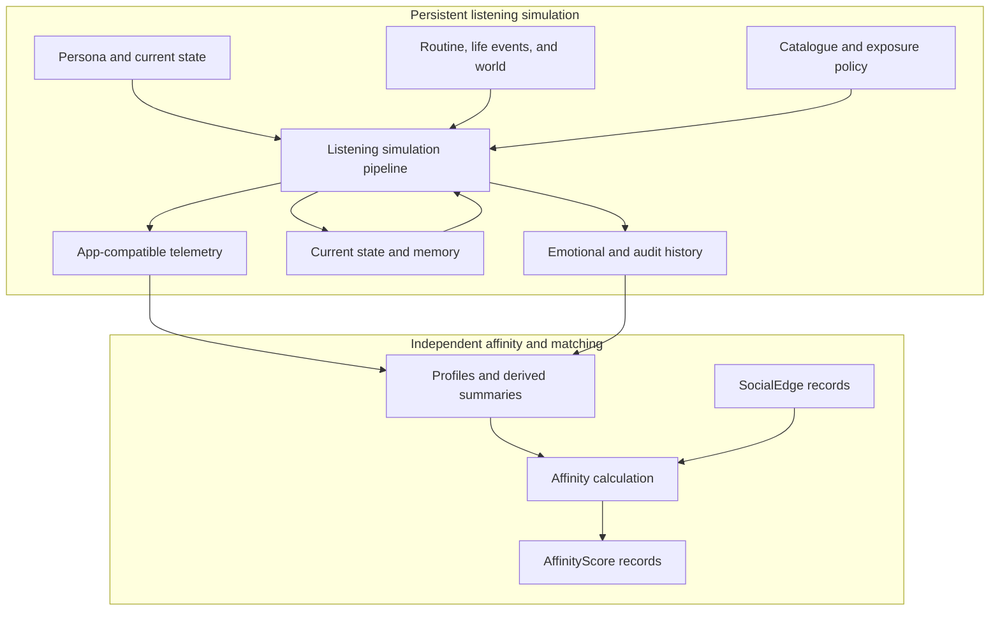
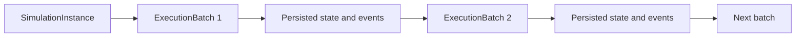
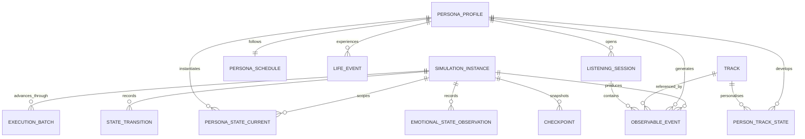
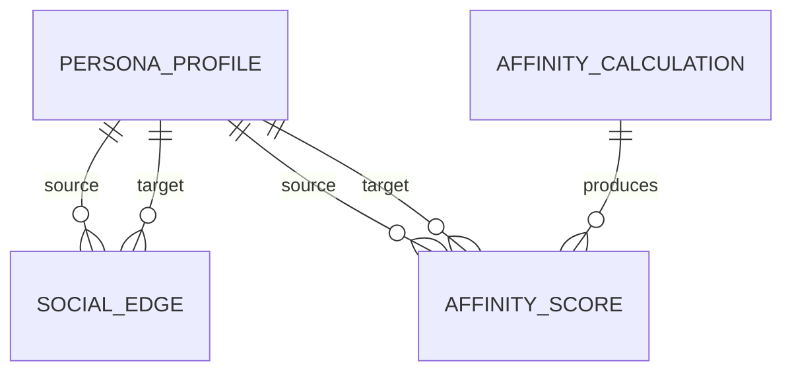
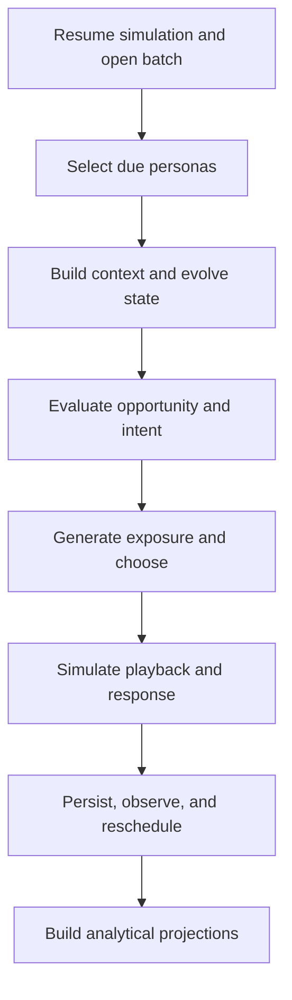
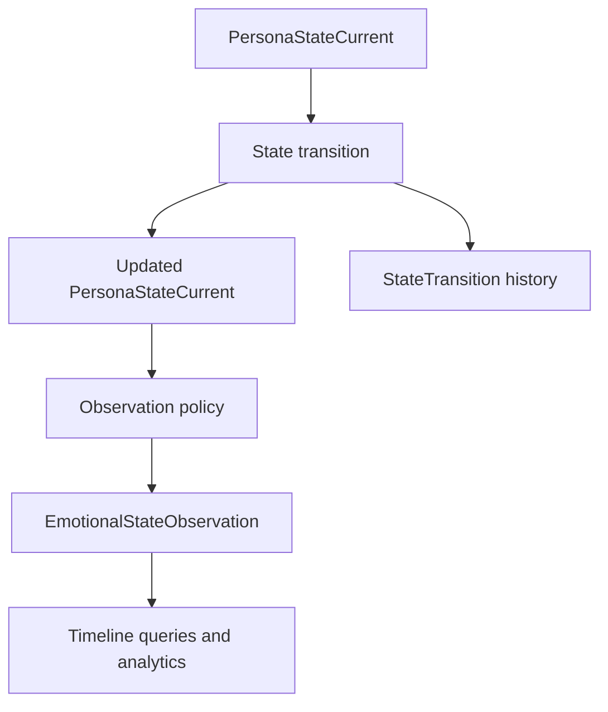
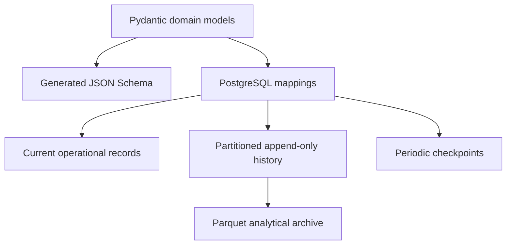

# Synthetic Listener Simulation — Concept Map

**Architecture version:** 2.0  
**Scope:** Persistent listening simulation, application tracking, emotional history, and independent affinity calculation

## Purpose

This document maps the principal entities, data flows, temporal layers, storage responsibilities, and pipeline boundaries used by VO Personas Simulation.

The system represents a synthetic persona as a persistent user whose state and history continue across scheduled executions:

> A persona is a persistent identity. An execution batch advances that identity through a continuous simulated world. Events and observations preserve what happened over time.

```text
SimulationFrame(t) =
    PersonaProfile
    + PersonaStateCurrent(t - 1)
    + PersonaSchedule(t)
    + active LifeEvents(t)
    + WorldState(location, t)
    + relevant music memory
    + application context
```

`SocialEdge` is deliberately absent from this formula. It belongs to the separate affinity and matching context and does not participate in listening simulation decisions.

## System Context



The arrow from listening outputs to affinity inputs is one-way. The listening pipeline does not read `SocialEdge` or `AffinityScore` in the current architecture.

## Continuous Execution Model



- `SimulationInstance` identifies one long-lived synthetic world.
- `ExecutionBatch` identifies one periodic script invocation.
- `logical_time` advances between batches independently from wall-clock time.
- `PersonaStateCurrent` is updated and reused by the next batch.
- Events retain `simulation_id` and `execution_id` for lineage.
- Experiments fork into a new `SimulationInstance` from a checkpoint rather than rewriting existing history.

## Entity Relationship Map



The affinity context has a separate relationship model:



`SocialEdge` represents an existing or simulated relationship. `AffinityScore` is a calculated result. Keeping them separate prevents a derived score from being mistaken for relationship evidence.

## Entity Groups

### Simulation control

- `SimulationConfig`: immutable, versioned scenario and policy definition.
- `SimulationInstance`: persistent world identity, lineage, logical clock, and frozen version references.
- `ExecutionBatch`: one attempt to advance a simulation through a time window.
- `Checkpoint`: immutable recovery point for operational state and event offsets.

### Persistent persona data

- `PersonaProfile`: stable and slowly changing identity.
- `PersonaStateCurrent`: latest dynamic state used by the next decision.
- `PersonaSchedule`: persona-specific routine reference and overrides.
- `ScheduleTemplate`: shared probabilistic routine structure.
- `LifeEvent`: sparse personal event affecting state and context.
- `PersonTrackState`: sparse relationship with an encountered track.
- `PersonArtistState`: optional sparse artist-level memory.

### Shared data

- `WorldState`: time-bucketed weather, daylight, season, holiday, and trend context.
- `Artist`: shared artist identity and catalogue metadata.
- `Track`: shared musical, lyrical, emotional, and catalogue attributes.
- `ExposurePolicy`: versioned content-source, ranking, position, and autoplay policy.

### Ephemeral listening runtime

- `ContextSnapshot`: resolved situation for one persona at one logical time.
- `SimulationFrame`: complete input to one behavioural evaluation.
- `ListeningIntent`: opportunity, desire, motive, and desired listening outcome.
- `ExposureSet`: content actually available or served to the persona.
- `CandidateEvaluation`: transient utilities and action probabilities.
- `PlaybackSessionState`: mutable state while a session is active.

### Durable listening outputs

- `ObservableEvent`: application-compatible event envelope with typed payload.
- `ListeningSession`: durable lifecycle and summary of an application session.
- `StateTransition`: canonical append-only delta for meaningful state changes.
- `EmotionalStateObservation`: compact query projection of the emotional journey.
- `OracleDecisionTrace`: hidden motives, utilities, probabilities, and random decisions.
- `DailyPersonaSummary`: derived daily behavioural and emotional aggregates.
- `SimulationMetrics`: versioned cohort or simulation-level analytical results.

### Independent affinity outputs

- `SocialEdge`: current or historical relationship evidence between two personas.
- `AffinityCalculation`: metadata for one versioned affinity computation.
- `AffinityScore`: sparse calculated compatibility result for one candidate pair.

## Listening Pipeline



| Stage | Main inputs | Principal result |
| --- | --- | --- |
| Resume | Configuration, checkpoint, current state | Validated execution context |
| Schedule | Logical clock, event queue, active sessions | Due work items |
| Context and state | Profile, state, routine, life events, world | Updated frame and state delta |
| Opportunity and intent | Frame, availability, habits | Listen or no-listen decision and motive |
| Exposure and choice | Catalogue, policy, music memory | Served candidates and selected action |
| Playback and response | Selected track, session state | Product actions and emotional response |
| Persistence | Events, transitions, observations | Durable history and latest state |
| Projection | Canonical histories | Queryable sessions, days, cohorts, and metrics |

`SocialEdge` and `AffinityScore` are not inputs to any stage in this table.

## Realistic Tracking Model

The simulator exposes two deliberately different views of the same persona:

### Observable application view

This contains only what Vibeout could receive through its product telemetry contract:

- Session start and end.
- Content exposure and position.
- Search, browse, and navigation actions.
- Track start, progress, pause, resume, seek, skip, completion, and repeat.
- Like, save, share, and other explicit feedback.
- A mood check-in only when the product explicitly asks the user.

Synthetic and real events share the same event envelope and semantics. They remain separated by physical dataset boundaries and by `data_origin`.

### Synthetic ground-truth view

This contains variables known only because the user is simulated:

- Latent emotional state.
- Active listening motive.
- Candidate utilities and choice probabilities.
- Music-induced emotional response.
- Random draws and model decisions.

Systems evaluated as if they were production systems must not read the synthetic ground-truth view.

## Emotional History Model



The three emotional representations serve different access patterns:

| Representation | Used by | Meaning |
| --- | --- | --- |
| `PersonaStateCurrent` | Listening simulator | Latest state plus rolling recent-history features. |
| `StateTransition` | Replay and audit | Canonical reason and delta for a meaningful change. |
| `EmotionalStateObservation` | Query and analytics | Compact timestamped projection of selected emotional variables. |

Observation triggers are configurable:

- Listening-session boundaries.
- Life-event boundaries.
- Meaningful state-change thresholds.
- Explicit mood check-ins.
- A periodic simulation-time heartbeat.

The simulator reads `PersonaStateCurrent`, not the full emotional timeline. Trend, volatility, and duration features are updated incrementally so history can influence behaviour without an expensive historical query on every decision.

## Storage Concept

Logical JSON entities do not become one file per persona.



| Storage class | Examples | Behaviour |
| --- | --- | --- |
| Mutable operational | Current state, active session, sparse memory | Upsert with version checks. |
| Immutable/versioned | Profiles, configuration, policies, catalogue versions | Insert new version; do not overwrite history. |
| Append-only history | Telemetry, transitions, emotional observations | Partition by simulation time and identifier. |
| Shared reference | Tracks, artists, weather, schedule templates | Store once and join by identifier. |
| Sampled audit | Full frames, complete candidate evaluations | Retain only by policy or allowlist. |
| Analytical archive | Closed historical partitions | Export to compressed Parquet when appropriate. |

PostgreSQL is the initial source of truth. JSON Schema documents class structure; JSON examples illustrate payloads; neither is a per-person storage strategy.

## Primary Identifiers

| Identifier | Purpose |
| --- | --- |
| `simulation_id` | Identifies one continuous synthetic world. |
| `execution_id` | Identifies one periodic batch that advances the world. |
| `scenario_id` | Identifies the versioned behavioural hypothesis and configuration. |
| `persona_id` | Joins profile, current state, memory, history, and summaries. |
| `state_version` | Enforces ordered and idempotent current-state updates. |
| `session_id` | Groups application actions into a listening session. |
| `event_id` | Identifies an immutable application-compatible event. |
| `transition_id` | Identifies a canonical state change. |
| `observation_id` | Identifies a point on the emotional-history projection. |
| `track_id` | Joins catalogue, exposure, memory, and listening activity. |
| `checkpoint_id` | Identifies a reproducible recovery point. |
| `affinity_calculation_id` | Identifies a separate affinity model execution. |

## Recommended First-Version Boundary

The first listening implementation should include:

1. `SimulationConfig`
2. `SimulationInstance`
3. `ExecutionBatch`
4. `PersonaProfile`
5. `PersonaStateCurrent`
6. `PersonaSchedule`
7. `WorldState`
8. `LifeEvent`
9. `Artist` and `Track`
10. `PersonTrackState`
11. `ExposurePolicy` and `ExposureSet`
12. `ObservableEvent`
13. `ListeningSession`
14. `StateTransition`
15. `EmotionalStateObservation`
16. `OracleDecisionTrace`
17. `Checkpoint`

The affinity context retains `SocialEdge`, `AffinityCalculation`, and `AffinityScore`, but its algorithm should be implemented only after the individual listening and history pipeline is stable.
